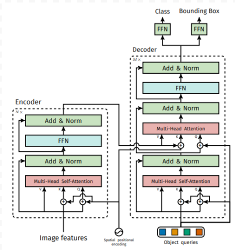
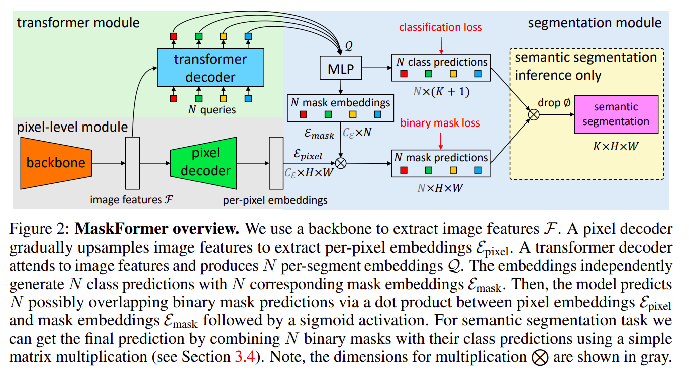
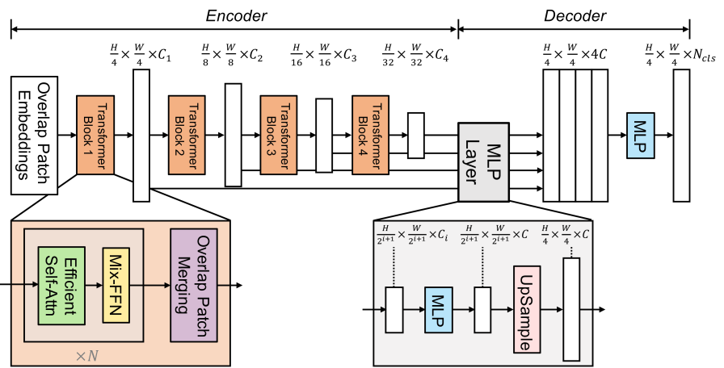
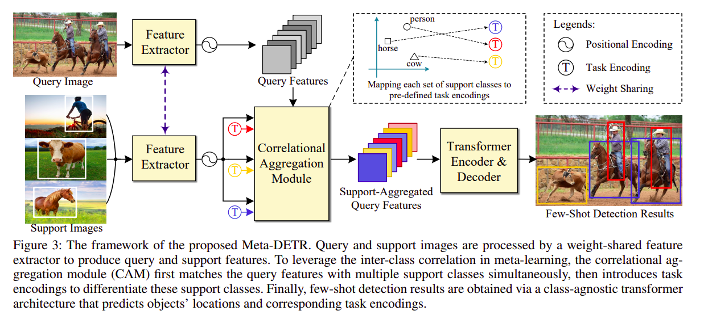
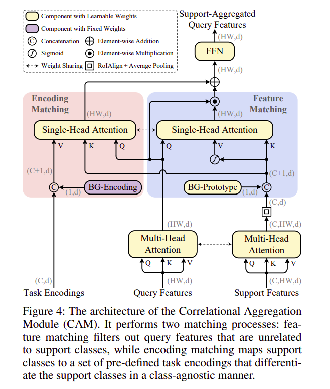
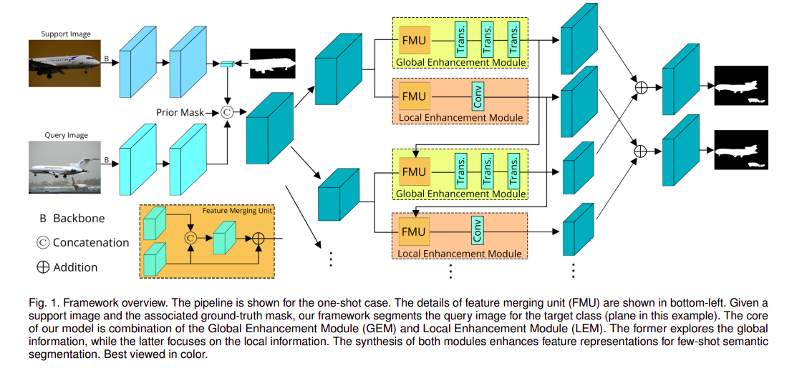
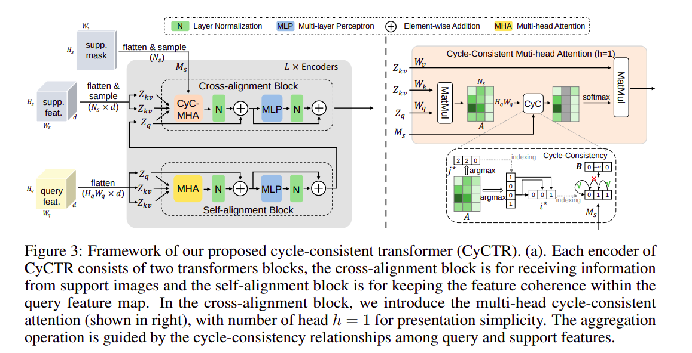
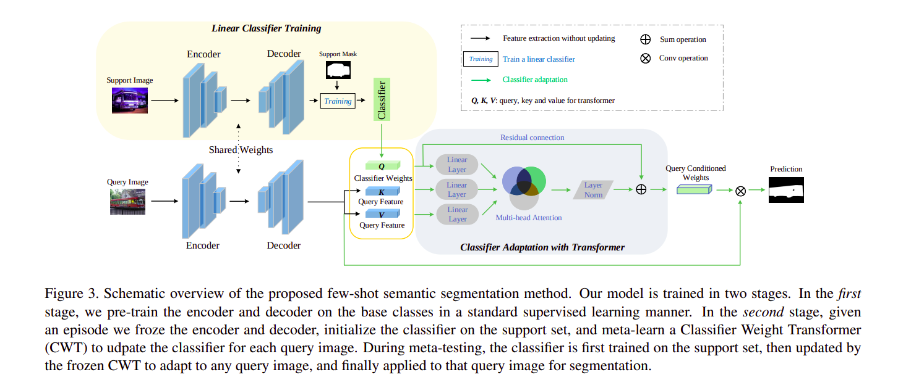

## Table of contents
* [Standard Transformer](#Standard-Transformer)
	* [Original Transformer](#Original-Transformer)
	* [ViT (Vision Transformer)](#ViT-Vision-Transformer)
* [Object Detection/Segmentation Transformer](#Object-Detection-Segmentation-Transformer)
	* [DETR (Detection Transformer)](#DETR-Detection-Transformer)
	* [AnchorDETR](#AnchorDETR)
	* [MaskFormer](#MaskFormer)
	* [TransUNet](#TransUNet)
	* [SegFormer](#SegFormer)
* [Few-shot Transformer](#Few-shot-transformer)
	* [Meta-DETR: Image-Level Few-Shot Object Detection with Inter-Class Correlation Exploitation](#Meta-DETR-Image-Level-Few-Shot-Object-Detection-With-Inter-Class-Correlation-Exploitation)
	* [Boosting Few-shot Semantic Segmentation with Transformers](#Boosting-Few-shot-Semantic-Segmentation-with-Transformers)
	* [Few-Shot Segmentation via Cycle-Consistent Transformer](#Few-Shot-Segmentation-via-Cycle-Consistent-Transformer)
	* [Few-shot Semantic Segmentation with Classifier Weight Transformer](#Few-shot-Semantic-Segmentation-with-Classifier-Weight-Transformer)
* [Resource](#Resource)

## Standard Transformer
### Original Transformer
+ **Paper**: https://arxiv.org/abs/1706.03762
  
+ **Input**: 
	- Sequence embedding (e.g. word embeddings of a sentence)
	- Positional Encoding => encode the _positions of embedding word within the sentence_ in the input of Encoder/Decoder block
+ **Encoder**:
	- Embedding words => Skip_Connection[**_MHA_** => Norm] => Skip_Connection[**_FFN_** => Norm] => Encoder output
		- **_MHA_**: Multi-Head Self Attention
		- **_FFN_**: FeedForward Neural Network
	+ Repeat N times (N usually 6)
+ **Decoder**:
	- Decoder input:
		- Leaned output of the decoder (initial token in the begining, learned sentence throughout the process)
		- Encoder input (put in the middle of the Decoder)
	- (Input + Positional Encoding) => Skip_Connection[**_MHA_** + Norm] => Skip_Connection[(+Encoder input) => **_MHA_** => Norm] => Skip_Connection[**_FFN_** + Norm] => Linear => Softmax => Decoder Output
	- Using the decoder output as the input for next round, repeat N times (N ussually 6)
+ [Read here](https://github.com/quanghuy0497/Deep-Learning-Specialization/tree/main/Course%205%20-%20Sequence%20Models#transformer-network-1) for more detail

### ViT (Vision Transformer)
+ **Paper**: https://arxiv.org/pdf/2010.11929.pdf
  
+ **Input**:
	-  Image [H, W, C] => non-overlapped patches (conventionally 16x16 patch size) => flatten into sequence => linear projection (vectorized + Linear) => **_patch embeddings_**
	- **_Positional encoding_** added to the patch embeddings for location information of the patchs sequence
	- Extra learnable `[Cls]` token (embedding) + positional 0 => attached on the head of the embedding sequence (denote as `Z0`)
+ **Architecture**: (Patch + Position Embedding) => Transformer Encoder => MLP Head for Classification
	-  **_Transformer Encoder_**: Skip_Connection[Norm => **_MHA_**] => Skip_Connection[Norm + **_MLP_**(Linear, GELU, Linear)] => output
	- **_MLP Head for classification_**:  `C0` (output of `Z0` after went through the Transformer Encoder) => **_MLP Head_** (Linear + Softmax) => classified label
+ **Good video explanation**: https://www.youtube.com/watch?v=HZ4j_U3FC94
+ **Code**: https://github.com/lucidrains/vit-pytorch

## Object Detection/Segmentation Transformer
### DETR (Detection Transformer)
+ **Paper**: https://arxiv.org/pdf/2005.12872.pdf  
  
+ **Transformer Encoder & Decoder**:
	- Share the same architecture with the original transformer
	- *Encoder:*
		- Input sequence: flattened 2D feature (Image => CNN => flatten) + learnable fixed positional encoding (add to each layer)
		- Output: encoder output in sequence
	- *Decoder:*
		- Input: Object queries (learned positional embeddings) + encoder output (input in the middle)
		- Output: output embeddings
		- The Decoder decode N objects in parallel at each decoder layer, not sequence one element at a time
		- The model can reason about all objects together using pair-wise relations between them, while being able to use whole image as content
+ **Prediction FFN**:
	- 3-layer MLP with ReLU  
	- Output embeddings as input
	- Predict normalized center coordinates, heigh and width of bounding box  
+ **Architecture**:
	Image => **_Backbone (CNN)_** => 2D representation => Flatten (+ Positional encoding) => **_Transformer Encoder-Decoder_** => **_Prediction FFN_** => bounding box
+ **Code**: https://github.com/facebookresearch/detr

### AnchorDETR
+ **Paper**: https://arxiv.org/pdf/2109.07107.pdf  
  
+ Backbone: ResNet40
+ The encoder/decoder share the same structure as DETE
	- However, the self-attention in the encoder and  decoder blocks are replaced by Row-Column Decouple Attention
+ **Row-Column Decouple Attention**:
	- Help reduce the GPU memeory when facing with high-resolution feature
	- Main idea:
		- Decouple key feature `Kf` into row feature `Kf,x` and column feature `Kf,y` by 1D global average pooling
		- Then perform the row attetion and column attentions speparately
+ **Code**: https://github.com/megvii-research/AnchorDETR

### MaskFormer
+ **Paper**: https://arxiv.org/pdf/2107.06278.pdf  
  
+ **Pixel-level module**:
	- Image => **_Backbone (ResNet)_** => image feature `F` => **_Pixel decoder (upsampling)_** => per-pixel embedding `E_pixel`
+ **Transformer module (Decoder only)**:
	- Standard Transformer decoder
	- N queries (learneable positional embeddings) + `F` (input in the middle) => **_Tranformer Decoder_** => N per-segment embeddings `Q`
	- Prediction in parallel (similar to DETR)
+ **Segmentation module**:
	- `Q` => *MLP (2 Linears + solfmax)* => N mask embeddings `E_mask` & N class predictions
	- *Dot_product*(`E_mask`, `E_pixel`) => sigmoid => Binary mask predictions
	- *Matrix_mul*(Mask predictions, class predictions) => Segmantic segmentation
+ **Code**: https://github.com/facebookresearch/MaskFormer

### TransUNet
+ **Paper**: https://arxiv.org/pdf/2102.04306.pdf  
  
+ **Downsampling (Encoder)**: using CNN-Transformer Hybrid
	+ (Medical) Image `[H, W, C]` => _**CNN**_ => 2D feature map => _**Linear Projection**_ (Flatten into 2D Patch embedding) => Downsampling => _**Tranformer**_ => Hidden feature `[n_patch, D]`
		- CNN: downsampling by 1/2 => 1/4 => 1/8
		- Transformer: Norm layer *before* MHA/FFN (rather than applying Norm layer after MHA/FFN like the original Transformer), total 12 layers
	+ Why using CNN-Transformer hybrid:
		- Leverages the intermediate high-resolution CNN feature maps in the Decoder
		- Performs better than the purge transformer
+ **Upsamling (Decoder)**: using Cascaded Upsampler 
	- Similar to the upsamling part of the [standard UNet](https://github.com/quanghuy0497/Deep-Learning-Specialization/tree/main/Course%204%20-%20Convolutional%20Neural%20Networks#u-net-architecture)
		- **_Upsampling_** => *concat* with corresponded CNN feature map (from the Encoder) => *Conv3x3 with ReLu*
		- **_Segmentation head_** (Conv1x1) at the final layer
	- Hidden Feature `[n_patch, D]` => reshape `[D, H/16, W/16]` => `[512, H/16, H/16]` => `[256, H/8, W/8]` => `[128, H/4, W/4]` => `[64, H/2, W/2]` => `[16, H, W]` => Segmentation head => Segmantic Segmentation
+ **Code**: https://github.com/KenzaB27/TransUnet

### SegFormer
+ **Paper**: https://arxiv.org/pdf/2105.15203.pdf  
  
+ **Input**: Image `[H, W, 3]` => patches of size 4x4 (rather than 16x16 like ViT)
	- Using smaller patches => favor the dense prediction task
	- Do not need positional encoding (PE):
		- Not necessary for semantic segmentation
		- The resolution of PS is fixed => needs to be interpolated when facing different test resolutions => dropped accuracy
+ **Hierarchical Transformer Encoder**: extract coarse and fine-grained features, partly inspired by ViT but optimized for semantic segmentation
	- Overlap patch embeddings => [**_Transformer Block_** => Downsampling]x 4 times => CNN-like multi-level feature map `Fi`
		- Feature map size: `[H, W, 3]` => `F1` `[H/4, W/4, C1]` => `F2` `[H/8, W/8, C2]` => ... => `F4` `[H/32, W/32, C4]`
			- Provide both high and low-resolution features => boost the performance of semantic segmentation
		- Transformer Block1: Efficient Self-Atnn => Mix-FNN => Overlap Patch Merging
			- **_Efficient Self-Attention_**: Use the reduction ratio R on sequence length N = H x W (in particular, apply stride R) => reduce the complexity by R times
			- **_Mix-FFN_**: Skip_Connection[MLP => Conv3x3 => GELU => MLP] which considers the effect of zero padding to leak location information (rather than positional encoding)
			- **_Overlapped Patch Merging_**: similar to the image patch in ViT but overlap => combine feature patches
+ **Lightweight All-MLP Decoder**: fuse the multi-level features => predict semantic segmentation mask
	1. **_1st Linear layer_**: unifying channel dimension of multi-level features `Fi` (from the encoder)  
	2. `Fi` are **_upsampler_** to 1/4th and **_concat_** together  
	3. **_2nd Linear layer_**: fusing concatenated features `F`
	4. **_3rd Linear layer_**: predicting segmentation mask M `[H/4, W/4, N_cls]` with `F`
+ **Code**: https://github.com/lucidrains/segformer-pytorch

## Few-shot Transformer
### Meta-DETR: Image-Level Few-Shot Object Detection with Inter-Class Correlation Exploitation
+ **Paper**: https://arxiv.org/pdf/2103.11731.pdf  

+ Employ Deformable DETR and original Transformers as basic detection framework
+ **Architecture**:
	- Query image, Support images => Feature Extractor(ResNet-101) => Positional Encoding => Query/Support features => **_Correlational Aggregation Module_** => Support-Aggregated Query Feature => **_Transformer Encoder-Decoder_** => **_Prediction Head_** => Few-shot detection
+ **Correlation Aggregation Module (CAM)**:
	  
	- Key-compoment in Meta-DETR => aggregates query features with support classes => class-agnostic prediction
		- Can aggregate multiple support classes simultaneously => capture inter-class correlations => reduce misclassification, enhance generalization
	- Pipeline:
		- Query & Support features => MHA => ROIAlign + Average pooling (on the support feature only) => Query feature map `Q` & Support prototypes `S` 
		- `S` = Concat(`S`, BG-Prototype); Task Encodings `T` = Concat(`T`, BG-Encoding)
		- [`Q`, `S`, `T`] => Feature maching & Encoding matching (in parallel) => FFN => Support-Aggregated Query Features
	- **_Feature matching_**:
		- [`Q`, Sigmoid(`S`), `S`] => Single-Head Attention => Element-wise multiplication => feature matching output `Qf`
	- **_Encoding Matching_**:
		- [`T`, `Q`, `S`] => Single-Head Attention => encoding output `Qe`
	- **_FFN_**:
		Element-wise Add(`Qf`, `Qe`) => FFN => Support-Aggregated Query features
+ **Transformer Encoder-Decoder**:
	- Follow the [Deformable DETR](https://arxiv.org/pdf/2010.04159.pdf) architecture with 6 layer
		- Adapt Multi-scale deformable attention, with the CAM is counted as one encoder layer
	- Support-Aggregated Query features => Encoder-Decoder => Embedding `E`
+ **Prediction Head**:
	- `E` => FC, Sigmoid => Confidence score
	- `E` => FC, ReLU + FC, ReLU + FC, Sigmoid => Bounding Box
+ **Code**: https://github.com/ZhangGongjie/Meta-DETR

### Boosting Few-shot Semantic Segmentation with Transformers
+ **Paper**: https://arxiv.org/pdf/2108.02266.pdf  

+ **Architecture**:
	- Support/Query Images => Backbone (VGG/ResNet) => PANet => PFENet => `X`
		- **_PANet_**: Computer similarity between query features and support prototypes
		- **_PFENet_**: Concat(Query features; Expanded Support Prototypes; Prior Mask)
	- `X` => **_Multi-scale Processing_** => **_Global/Local Enhancement Module_** (with 2 ouput `T` and `Z` respectively) => Concat(T, Z) => MLP => Few-shot Semantic Segmentation
+ **Multi-scale Processing**:
	- Information over different scales (of the input feature maps `X` from support/query images) can be utilized
	- Multi-scaling with Global Average Pooling => feature Pyramid `Xi` = {X1, X2,...,Xn}
+ **Global Enhancement Module (GEM)**:
	- Using **_Transformer_** => enhance the feature to exploit the global information
	- `Xi` => FC layer (for channel reduction) => `X'i` => **_Feature Merging Unit_** (FMU) => `Yi`
		- FMU: 
			- `Yi` =  `X'i` if i=1; 
			- `Yi` =  (Conv1x1(*Concat*(`X'i`, `Ti-1`)) + `X'i`) if i>1
	- `Yi` => [**_MHA_** => MLP (2 Linear)] => MHA => `Ti` => `T`
		- MHA with GELU and Norm
		- [MHA => MLP] repeat L times with L = 3
		- `T` = = *Concat*(T1, T2,...Tn) at layer L
+ **Local Enhancement Module (LEM)**:
	- Follow the same pipeline as GEM:
		- `Xi` => FC layer => FMU => `Yi` => Conv => output
	- Rather than using transformer in GEM, LEM using **_Convolutional_** => encode the local information
	- LEM output: {Z1, Z2,...,Zn}  
+ **Segmentation Mask Prediction**:
	- Local/Global output: `Z` = *Concat*(Z1, T2,...Tn)
	- `Z` => MLP => target mask `M`
+ **Code**: https://github.com/GuoleiSun/TRFS

### Few-Shot Segmentation via Cycle-Consistent Transformer
+ **Paper**: https://arxiv.org/pdf/2106.02320.pdf  
  
+ **Architecture**:
	+ Query & Support Images => Backbone (ResNet) => Image features `Xq` and `Xs` => Concat the mask averaged support feature to `Xq` and `Xs` => Flatten into 1D sequence by Conv1x1 (with shape HW x D) => (**_CyC-Transformer_**, L times) => reshaping => **_Conv-head_** => segmentation mask
	+ `Xq` and `Xs` has token represented by feature `z` at on pixel location => beneficial for segmentation
+ **CyC-Transformer**:
	+ **_Self-Alignment block_**:
		- Just like the original Transformer encoder
		- Flatten query feature as input (query only)
		- Pixel-wise feature of query images => aggregate their global context information
	+ **_Cross-alignment block_**:
		- Replace MHA with **_CyC-MHA_**
		- Flatten query feature and sample of support feature as input
		- Performs attention between query and support pixel-wise features => aggregate relevant support feature into query ones
	+ **_Cycle-Consistent Multi-head Attention (CyC-MHA)_**:
		- Alleviate the excessive harmful support features that confuse pure pixel-level attention
		- Pipeline:
			-  Affinity map A is calculated => measure the correspondence relationship between all query and support tokens
			- For a single token position j (j={0,...Ns}), its most similar point `i*` = argmax A(`i`,`j`) with i={0,...HqWq} is the index of flatten query feature
			- Construct **_Cycle-consistency_** (CyC) relationship for all tokens in the support sequence
				- The cycle-consistency help avoids being bias by possible harmful feature effectively (facing when training for few-shot segmentation)
			- Finally, CyC-MHA = softmax(Ai + B)V
				- Where B (with only 2 value -inf and 0) is the additive bias element-wise added to aggregate support feature and V is the value sequence
		- With B, the attention weight tends to be zero => irrelevant information will not be consider
		- CyC encourages the consistency between most relative features between query and support => produce consistent feature representation
+ **Conv-head**:
	- Output of CyC-MHA => reshaping to spatial dimensions => Conv-Head (Cov3x3 => ReLu => Conv1x1) => Segmentation Mask
+ **Code**: To be updated

### Few-shot Semantic Segmentation with Classifier Weight Transformer
+ **Paper**: https://arxiv.org/pdf/2108.03032.pdf  
  
+ **Architecture**:
	- **_First stage_**: pre-train encoder/decoder (**PSPNet** pre-trained on ImageNet) with supervised learning => stronger representation
		- Support/Query Image => Encoder-Decoder (**PSPNet**) => Linear clasifier with Support Mask (Support only) => Classifier (Support only) => [Classifier weight `Q`, Query feature `K`, Query feature `V`]
	- **_Second stage_**: meta-train the Classifier Weight Transformer (CWT) only (as the encoder-decoder capapble to capture generalization of unseen class)
		- [`Q`,`K`,`V`] => Skip_Connection[Linear => MHA => Norm] => Conv operation with `Q` => Prediction Mask
+ **Code**: https://github.com/zhiheLu/CWT-for-FSS

## Resource
+ Papers collection about Transformer in Computer Vision: 
	- https://github.com/dk-liang/Awesome-Visual-Transformer
	- https://github.com/DirtyHarryLYL/Transformer-in-Vision
	- https://github.com/Yangzhangcst/Transformer-in-Computer-Vision
