## About
This repository summaries Transformer-based architectures in the Computer Vision aspect, from the very basic (classification) to complex (object detection, segmentation, few-shot learning) tasks.

The main purpose of this list is to review and recap only the main approach/pipeline/architecture of these papers to capture the overview of **transformers for vision**, so other parts of the papers e.g. experimental performance, comparison results won't be presented. For a better intuition, please read the original article and code that are attached along with the recap sections. Of course, there might be some mistakes when reviewing these papers, so if there is something wrong or inaccurate, please feel free to tell me.

The paper summarizations list will be updated regularly.

## Table of contents
* [**Standard Transformer**](#Standard-Transformer)
	* [Original Transformer](#Original-Transformer)
	* [ViT (Vision Transformer)](#ViT-Vision-Transformer)
	* [VTN (Video Transformer Network)](#VTN-Video-Transformer-Network)
	* [ViTGAN (Vision Transformer GAN)](#VitGAN-Vision-Transformer-GAN)
	* [Conv Block Attention Module](#Conv-Block-Attention-Module)
	* [Do Vision Transformer see like CNN?](#Do-Vision-Transformer-see-like-CNN)
* [**Optimization Transformer**](#Optimization-Transformer)
	* [How to train ViT?](#How-to-train-ViT)
	* [Efficient Attention](#Efficient-Attention)
	* [Linformer](#Linformer)
	* [Longformer](#Longformer)
	* [Personal hypotheses](#Personal-hypotheses)
* [**Classification Transformer**](#Classification-Transformer)
	* [Instance-level Image Retrieval using Reranking Transformers](#Instance-Level-Image-Retrieval-using-Reranking-Transformers)
	* [General Multi-label Image Classification with Transformers](#General-Multi-Label-Image-Classification-with-Transformers)
* [**Object Detection/Segmentation Transformer**](#Object-DetectionSegmentation-Transformer)
	* [DETR (Detection Transformer)](#DETR-Detection-Transformer)
	* [AnchorDETR](#AnchorDETR)
	* [MaskFormer](#MaskFormer)
	* [SegFormer](#SegFormer)
	* [Fully Transformer Networks](#Fully-Transformer-Networks)
	* [TransUNet](#TransUNet)
	* [UTNet (U-shape Transformer Networks)](#UTNet-U-shape-Transformer-Networks)
	* [SOTR (Segmenting Objects with Transformer)](#SOTR-Segmenting-Objects-with-Transformer)
	* [HandsFormer](#HandsFormer)
	* [Unifying Global-Local Representations in Salient Object Detection with Transformer](#Unifying-Global-Local-Representations-in-Salient-Object-Detection-with-Transformer)
* [**Few-shot Transformer**](#Few-shot-transformer)
	* [Meta-DETR: Image-Level Few-Shot Object Detection with Inter-Class Correlation Exploitation](#Meta-DETR-Image-Level-Few-Shot-Object-Detection-With-Inter-Class-Correlation-Exploitation)
	* [Boosting Few-shot Semantic Segmentation with Transformers](#Boosting-Few-shot-Semantic-Segmentation-with-Transformers)
	* [Few-Shot Segmentation via Cycle-Consistent Transformer](#Few-Shot-Segmentation-via-Cycle-Consistent-Transformer)
	* [Few-shot Semantic Segmentation with Classifier Weight Transformer](#Few-shot-Semantic-Segmentation-with-Classifier-Weight-Transformer)
	* [Few-shot Transformation of Common Actions into Time and Space](#Few-shot-Transformation-of-Common-Actions-into-Time-And-Space)
	* [A Universal Representation Transformer Layer for Few-Shot Image Classification](#A-Universal-Representation-Transformer-Layer-for-Few-Shot-Image-Classification)
* [**Resources**](#Resources)

## **Standard Transformer**
This section introduces original transformer architecture in NLP as well as its versions in Computer Vision, including ViT for image classification, VTN for video classification, and ViTGAN for the generative adversarial network. Finally, a deep comparision between ViT and ResNet is introduced, to see deep down if the anttention-based model is similar to the Conv-based model.

### Original Transformer
+ **Paper**: https://arxiv.org/abs/1706.03762
  
+ **Input**: 
	- Sequence embedding (e.g. word embeddings of a sentence)
	- **Positional Encoding (PE)** => encode the _positions of embedding word within the sentence_ in the input of Encoder/Decoder block
		- [_Detailed explanation_](https://kazemnejad.com/blog/transformer_architecture_positional_encoding/) of PE 
+ **Encoder**:
	- Embedding words => Skip_Connection[**_MHSA_** => Norm] => Skip_Connection[**_FFN_** => Norm] => Encoder output
		- **_MHSA_**: Multi-Head Self Attention  
			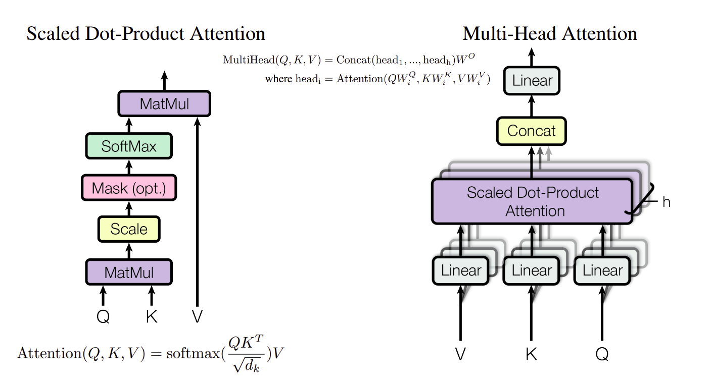  
		- **_FFN_**: FeedForward Neural Network
	+ Repeat N times (N usually 6)
+ **Decoder**:
	- Decoder input:
		- Leaned output of the decoder (initial token in the begining, learned sentence throughout the process)
		- Encoder input (put in the middle of the Decoder)
	- (Input + Positional Encoding) => Skip_Connection[**_MHSA_** + Norm] => Skip_Connection[(+Encoder input) => **_MHSA_** => Norm] => Skip_Connection[**_FFN_** + Norm] => Linear => Softmax => Decoder Output
	- Using the decoder output as the input for next round, repeat N times (N ussually 6)
+ [Read here](https://github.com/quanghuy0497/Deep-Learning-Specialization/tree/main/Course%205%20-%20Sequence%20Models#transformer-network-1) to learn in detail about the MHSA and Transformer architectures
	+ Also [here](https://phamdinhkhanh.github.io/2019/06/18/AttentionLayer.html) if you prefer detailed explanation in Vienamese
	+ Computational complexity between Self-Attention; Conv and RNN:  
		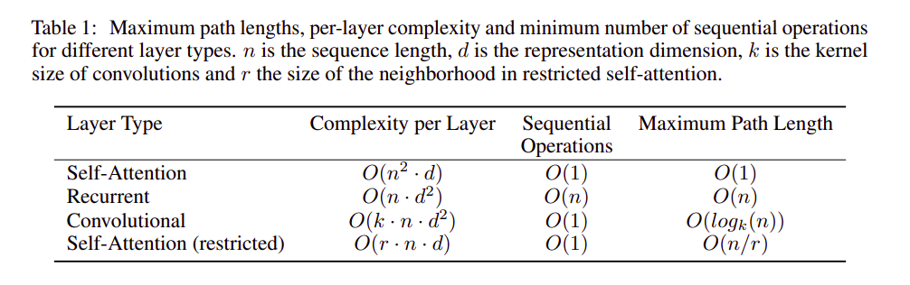  
+ **Codes**: https://github.com/SamLynnEvans/Transformer

### ViT (Vision Transformer)
+ **Paper**: https://arxiv.org/pdf/2010.11929.pdf
  
+ **Input**:
	-  Image [H, W, C] => non-overlapped patches (conventionally 16x16 patch size) => flatten into sequence => linear projection (vectorized + Linear) => **_patch embeddings_**
	- **_Positional encoding_** added to the patch embeddings for location information of the patchs sequence
	- Extra learnable `[Cls]` token (embedding) + positional 0 => attached on the head of the embedding sequence (denote as `Z0`)
+ **Architecture**: (Patch + Position Embedding) => Transformer Encoder => MLP Head for Classification
	-  **_Transformer Encoder_**: Skip_Connection[Norm => **_MHSA_**] => Skip_Connection[Norm + **_MLP_**(Linear, GELU, Linear)] => output
	- **_MLP Head for classification_**:  `C0` (output of `Z0` after went through the Transformer Encoder) => **_MLP Head_** (Linear + Softmax) => classified label
+ **Good video explanation**: https://www.youtube.com/watch?v=HZ4j_U3FC94
+ **Code**: https://github.com/lucidrains/vit-pytorch

### VTN (Video Transformet Network)
+ **Paper**: https://arxiv.org/pdf/2102.00719.pdf  
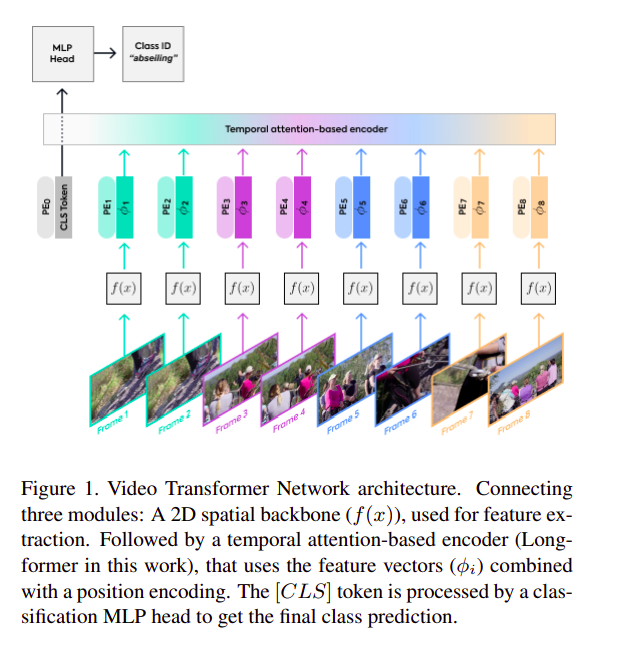  
+ Based on Longformer - transformer-based model can process a long sequence of thousands of tokens
+ **Pipeline**: Quite similar to the standard ViT
	- **_The 2D spatial backbone_** `f(x)` can be replaced with any given backbone for 2D images => feature extraction
	- **_The temporal attention-based encoder_** can stack up more layers, more heads, or can be set to a different Transformers model that can process long sequences. 
		- Note that a special classification token `[CLS]` is added in front of the feature sequence => final representation of the video => classification task head for video classifies
	- **_The classification head_** can be modified to facilitate different video-based tasks, i.e. temporal action localization
+ **Code**: https://github.com/bomri/SlowFast/tree/master/projects/vtn

### ViTGAN (Vision Transformer GAN)
+ **Paper**: https://arxiv.org/pdf/2107.04589.pdf  
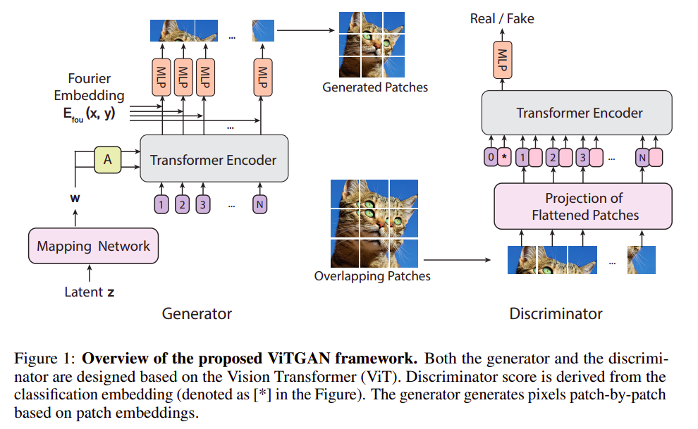  
+ Both the generator and the discrimiator are designed based on the stadard ViT, but with modifications
+ **Architecture**:
	+ **_Generator_**: Input latent `z` => _Mapping Network_ (MLP) => latent vector `w` => _Affine transform_ `A` => _Transformer Encoder_ => _Fourier Encoding_ (sinusoidal/sine activation) => `E_fou` => _2-layer MPL_ => Generated Patches
		- **_Transformer Encoder_**: 
			- Embedding position => Skip_Connection[SLN => MHSA] => Skip_Connection[SLN =>MLP] => output
			- SLN is called **_Self-modulated LayerNorm_** (as the modulation depends on no external information)
				- The SLN formula is describe within the paper (Equation 14)
			- Embedding `E` as initial input; `A` as middle inputs for the norm layers
	+ **_Discriminator_**: the pipeline architecture is similar to the standard ViT model, but with several changes:
		- Adapt the overlapping patches at the begining (rather than the nonoverlapping ones)
		- Replace the dot product between `Q` and `K` with Euclidean (L2) distance in the Attention formula
		- Apply spectral normalization (read paper for more information)
+ **Code**: To be updated

### Conv Block Attention Module
+ **Paper**: https://arxiv.org/pdf/1807.06521v2.pdf  
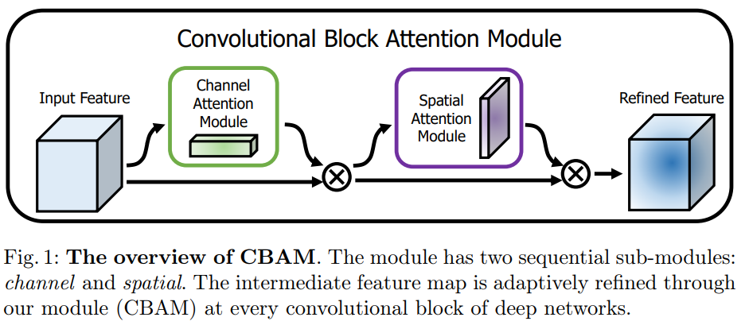  
+ Conv Block Attention Module (CBAM): A light weight and general attention-based module which can be used for FFN
+ **Architecture**:
	- Intermediate feature map => infer 1D channel attetion map and 2D spatial map => multiplied to the input feature map => adaptive feature refinement  
	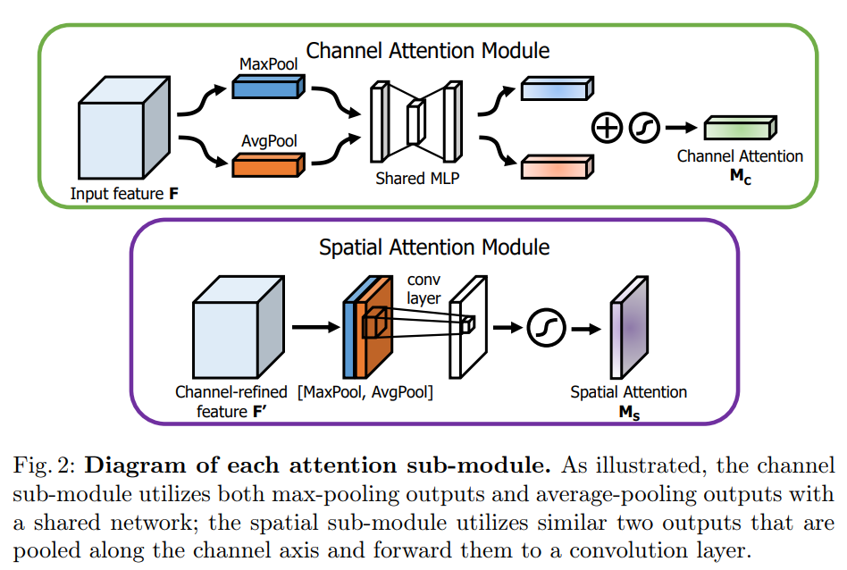  
	- **_Channel attention module_**: exploiting the inter-channel relationship of features
		- Feature map F => AvgPool || MaxPool => Share MLP [3 layers, ReLU] => element-wise summation => sigmoid => Channel attention Mc
	- **_Spatial attention module_**: utilizing the inter-spatial relationship of feature
		- Channel-refine feature F' => [AvgPool, MaxPool] => Conv7x7 => sigmoid => Spatial attention Ms
+ CBAM can be combine with ResBlock:
	- Conv => Skip_connection(CBAM) => Next Conv

### Do Vision Transformer see like CNN?
+ **Paper**: https://arxiv.org/pdf/2108.08810.pdf  
+ **Representations Structural**:
	- ViTs having _highly similar representations throughout the model_, while the ResNet models show much _lower similarity_ between lower and higher layers. 
		- ViT lower layers compute representations in a different way to lower layers in the ResNet.
		- ViT also more _strongly propagates representations_ between lower and higher layers.
		- The highest layers of ViT have _quite different representations_ to ResNet.   
			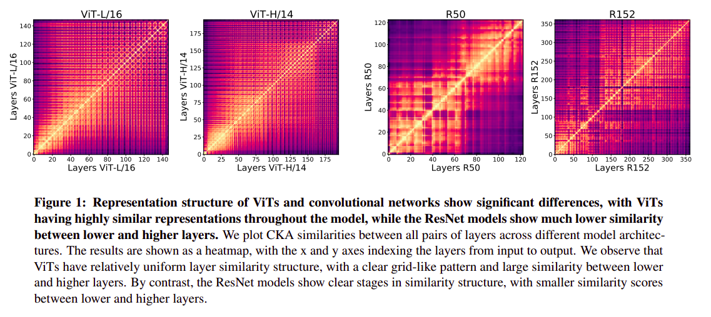  
+ **Local and Global Information in layer Representations**:
	- ViTs have _access to more global information_ than CNNs in their lower layers, leading to _quantitatively different features_ than (computed by the local receptive fields in the lower layers of the) ResNet.
		- Even in the **_lowest layers_** of ViT, self-attention layers have a _mix of local heads_ (small distances) _and global heads_ (large distances) => in contrast to CNNs, which is hardcoded to attend _only locally_ in the lower layers. 
		- At **_higher layers_**, all self-attention heads are _global_.
	- _Lower layer effective receptive fields_ for ViT are larger than in ResNets, and while ResNet effective receptive fields grow gradually, ViT receptive fields become much _more global midway through the network_.
		 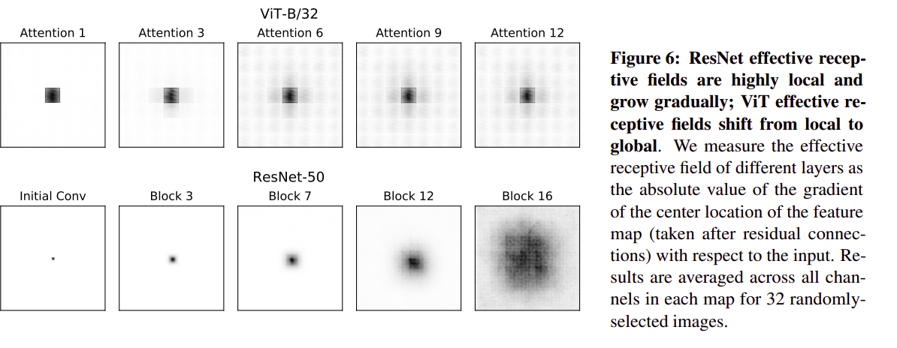
+ **Representation Propagation through Skip connections**:
	- **_Skip connections_** in ViT are even _more influential_ than in ResNet => strong effects on performance and representation similarity
		- Skip connections play a key role in the _representational structure_ of ViT.  
		- Skip connections play an key roles of _propagating the representations throught out the ViT_ => uniform structure in the lower and higher layers.  
			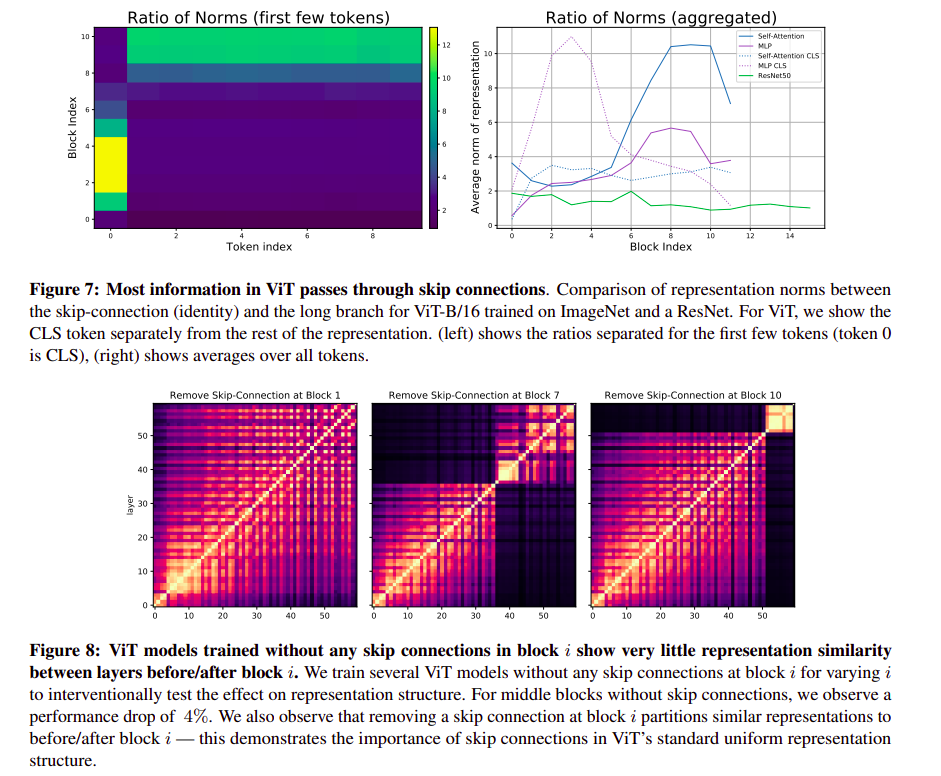  
+ **Spatial Information and Localization**:
	- _Higher layers of ViT maintain spatial location information more faithfully_ than ResNets.  
		- ViTs with **_CLS tokens_** show _strong preservation of spatial information_ — promising for future uses in object detection.  
			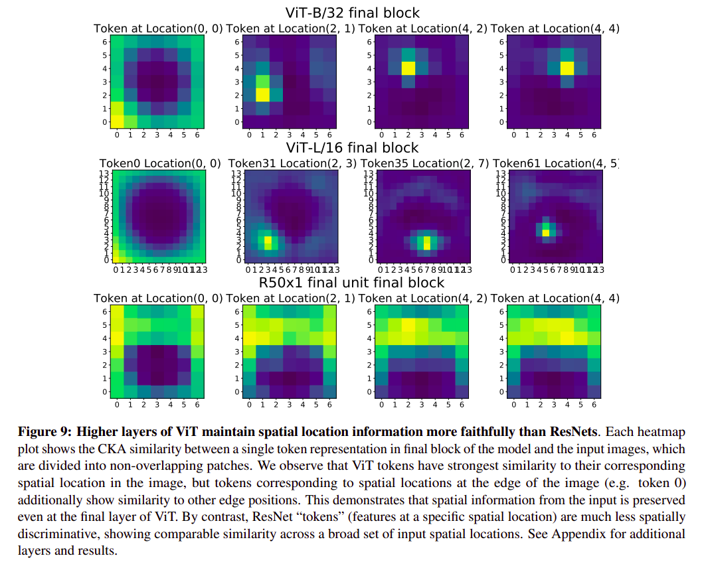  
		- When trained with global average pooling (GAP) instead of a CLS token, ViTs show _less clear localization_. 
		- ResNet50 and ViT with GAP model tokens _perform well at higher layers_, while in the standard ViT trained with a CLS token the spatial tokens do poorly – likely because their representations remain spatially localized at higher layers, which makes global classification challenging.  
			  
+ **Effects of Scale on Transfer Learning**:
	- For larger models, the **_larger dataset_** is especially helpful in _learning high-quality intermediate representations_.
	- While lower layer representations have _high similarity_ even with 10% of the data, higher layers and larger models _require significantly more data_ to learn similar representations.
	- Larger ViT models develop _significantly stronger intermediate_ representations through _larger pre-training datasets_ than the ResNets.

## **Optimization Transformer** 
This section introduces techniques of training vision transformer-based model effectively with optimization methods (data, augmentation, regularization,...). As the Scaled Dot-Product Attention comes with quadratic complexity **O(N^2)**, several approaches (Efficient Attention, Linformer) are introduced to reduce the computational complexity down to linear **O(N)**. Finally, I have some hypotheses (which aren't certainly proved) for the complexity optimization of matmul technique.

### How to train ViT?
+ **Paper**: https://arxiv.org/pdf/2106.10270.pdf  
+ **Experimental hyperparameters**:
	+ Pre-trained
		- Adam optimization with b1 = 0.9 and b2 = 0.999
		- Batch size 4096
		- Cosine learning rate with linear warmup 10k step
		- Gradient clipping at global norm 1
	+ Fine-tune:
		- SGD optimization with momentum 0.9
		- Batch size of 512
		- Cosine decay learning rate schedule with a linear warmup
		- Gradient clipping at global norm 1
+ **Regularization & augmentation**:
	- By the judicious (wise) amount of regularization and image augmentation, one can (pre-)train a model to **_similar accuracy_** by increasing the dataset size by about an order of magnitude.
	- **_Deterioration_** in validation accuracy **_increase_** when using various amounts of augmentation (RandAugment, Mixup) and regularization (Dropout, StochasticDepth).
		- Generally speaking, there are significantly more cases where adding augmentation helps, than where adding regularization helps
		- For a relatively small amount of data, almost everything helps. But in large scale of data, almost everything hurt; only when also increasing computer, does augmentation help again
+ **Transfer**:
	- No matter how much training time is spent, it does not seem possible to train ViT models from scratch to reach accuracy anywhere near that of the transferred model. => transfer is the **_better option_**
	- Furthermore, since pre-trained models are feely to download, the pre-training cost for practitioners is effectively zero
	- Adapting only the best pre-trained model **_works equally_** to adapting all pre-trained models (and then selecting the best) 
		- Then selecting a single pre-trained model based on the upstream score is a cost-effective practical strategy
+ **Data**:
	- More data yields **_more generic models_** => recommend that the design choice is using more data with a fixed compute budget
+ **Patch-size**:
	- Increasing patch size to shrinking model size
	- Using a larger patch-size (/32) significantly outperforms making the model thinner (/16)

### Efficient Attention
+ **Paper**:  https://arxiv.org/pdf/1812.01243v9.pdf  
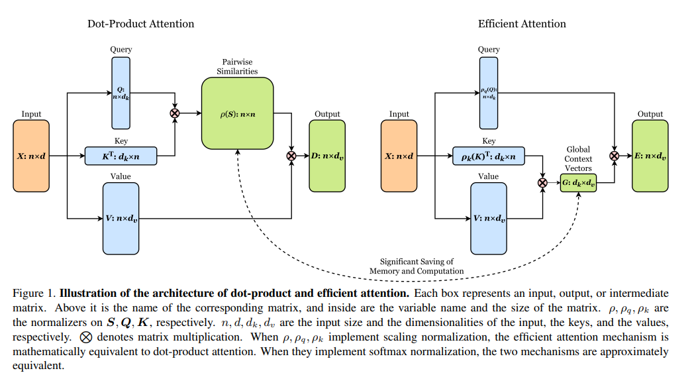  
+ **Efficient Attention**:
	- Linear memory and computational complexity O(d^2.n)
	- Possess the same representational power as the convention dot-product attention
	- Actually, it comes with better performance than the convention attention
+ **Method**:
	- Initially, feature X => 3 linears => `Q`: [n, k]; `K`: [n, k]; `V`: [n, c] with k and c are the dimensionalities of keys and inputs.
	- The **_Dot-product Attetion_** is calculated by: `D(Q,K,V) = p(Q.K^T).V`. => scale with `sqrt(k)` => sigmoid
		- p is the normalization
		- The `Q.K^T` (denoted _Pairwise similarity_ `S`) have the shape [n, n] => `S.V` have the shape [n, c] => **O(n^2)**
	- The **_Efficient Attention_** is calculated by: `E(Q,K,V) = p(Q.(K^T.V))` => scales with `sqrt(n)` => sigmoid
		- p is the normalization
		- The `K^T.V` (denoted _Global Context Vectors_ `G`) have the shape [k, c] with `k` & `c` are constants => O(1)
		- Then, `Q.G` have the shape [n, c] => **O(n)** 
+ Then, the _Dot-product Attetion_ and the _Efficient Attention_ are equivalence with each other with mathematic proof:
	
+ Explanation from the author: https://cmsflash.github.io/ai/2019/12/02/efficient-attention.html
+ **Code**:
	- https://github.com/cmsflash/efficient-attention
	- https://github.com/lucidrains/linear-attention-transformer

### Linformer
+ **Paper**: https://arxiv.org/pdf/2006.04768.pdf  
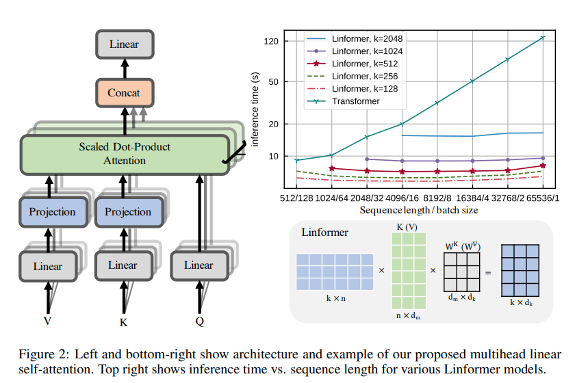  
+ The convention Scaled Dot-Product Attention is decomposed into multiple smaller attentions through linear projections, such that the combination of these operations forms a low-rank factorization of the original attention. Reduce the complexity to O(n) in time and space
+ **Method**:
	- Add two linear projection matrices `Ei` and `Fi` [n, k] when computing `K` & `V`
		- From `K`, `V` with shape [n, d] => `Ei.K`, `Fi.V` with shape [k, d]
	- Then, calculate the Scaled Dot-Product Attention as usual. The operation only requires **O(nk)** time and space complexity.
		- If the projected dimension `k` is very small in comparison with `n`, then _O(n)_
+ **Code**: 
	- https://github.com/tatp22/linformer-pytorch
	- https://github.com/lucidrains/linformer

### Longformer
+ **Paper**: https://arxiv.org/pdf/2004.05150.pdf  
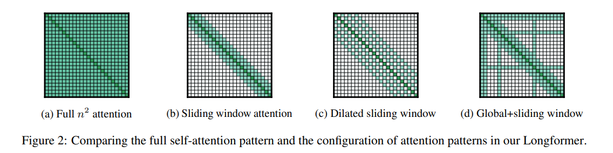  
+ Longformer is developed for long document in NLP, but it can also be applied for video processing
+ **Method**:
	- **_Sliding Window_**: 
		- With an arbitrary window size `w`, each token in the sequence will only attend to some `w` tokens (mostly `w/2` on each side) => the computation complexity is _O(n x w)_
		- With `l` layers of the transformer, the receptive field of the sliding window attention is [l x w]
	- **_Dilated Sliding Window_**:
		- To further increase the receptive field without increasing computation, the sliding window can be “dilated”, similar to the dilated CNNs
		- With the number of gaps between each token in the window `d`, the dilated attention has the dilation size of `d`.
		- Then, the receptive field of dilated sliding window attention is [l x d x w]
	- **_Global Attention_** (full self-attention):
		- The windowed and dilated attention are not flexible enough to learn task-specific representation 
		- The global attention is added to few pre-selected input locations to tackle the problem.
	- **_Linear Projection for Global Attention_**:
		- 2 separate sets [Qs, Ks, Vs] and [Qg, Kg, Vg] was used for sliding window and global attention, respectively
		- This provides flexibility to model the different types of attention patterns
+ **Code**: https://github.com/allenai/longformer

### Personal hyotheses
+ I wonder if we apply the **row/column multiplication** methods (read [**_here_**](Images/matrix_multiplication.pdf) for more details), does the computational complexity of matrix multiplication might reduce?  
	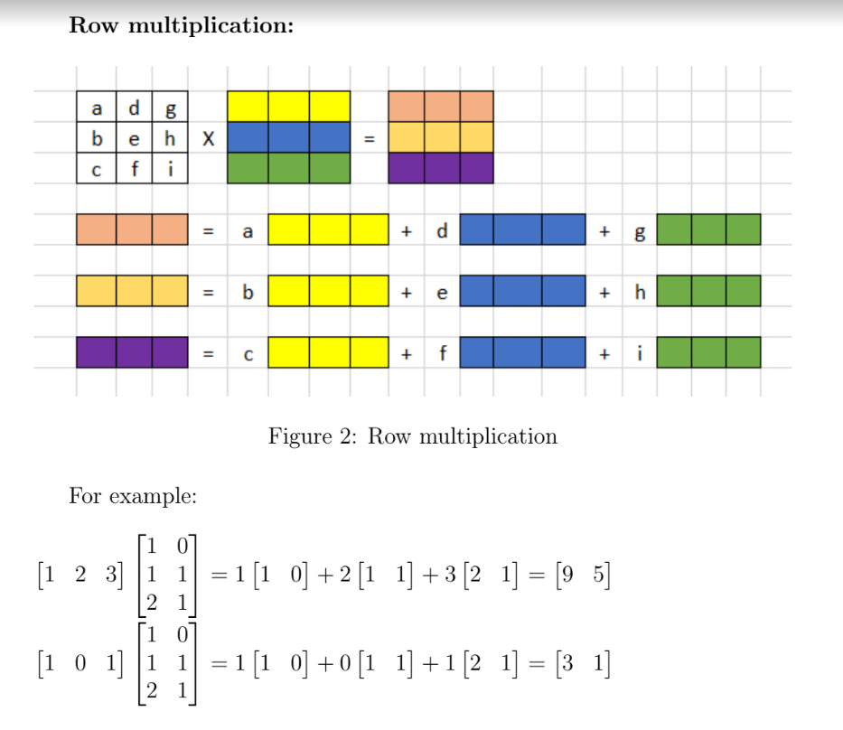  
	- With A and B are [N x N] matrices, then the normal matrix multiplication has O(N^3) complexity
	- However, I believe with the row/column multiplication, the computation complexity might reduce to O(N^2):
		- Just a thought, maybe I'm wrong. Need to verify
	- Then again, the multiplication inside the Scaled Dot-Product Attention is between two embeddings [1 x N], which has the complexity O(N^2), I do not think we can reduce the computational complexity with this simple row/column multiplication.
+ Another option is applying [**FFT**](https://en.wikipedia.org/wiki/Fast_Fourier_transform) (Fast Fourier Transform) to reduce the computation time
	- In fact, it reduces the complexity from O(N^3) down to O(N.logN)
	- But does it generalize well with the input embeddings of the Scaled Dot-Product Attention? Of course, the input embedding have to be normalized in prior, but what if we want to work with different shape of input i.e. high-resolution images? 

## **Classification Transformer**
This section introduces trasformer-based models for image classification and its sub-tasks (image pairing or multi-label classification). Of course, the paper reviewed list will be updated regularly.

### Instance-level Image Retrieval using Reranking Transformers
+ **Paper**: https://arxiv.org/pdf/2103.12236.pdf  
  
+ **Reranking Transformers (RRTs)**: lightweight small & effective model learn to predict the similarity of image pair directly based on global & local descriptor
+ **Pipeline**: 
	- 2 Image X, X' => _Global/Local feature discription_ => _preparation_ => _RRTs_ => z[cls] => _Binary Classifier_ => Do X and X' represent the same object/scene?
	- **_Preparation_**: 
		- Attach with 2 special tokiens at the head of X and X':
			- [ClS]: summarize signal from both image
			- [SEP]: to extra separator tokien (distinguise X and X')
		- Positonal encoding
	- **_Global/local representation_**: ResNet50 backbone; extra linear projector to reduce global descriptor dimension; L2 norm to unit norm
	- **_RRTs_**:
		- Same as the standard transformer layer: Skip_Connection[Input => MHSA] => Norm => MLP => Norm => ReLU; with 4 layers
		- 6 layers with 4 MSHA head 
	- **_Binary Classifier_**:
		- Feature vector Z[Cls] from the last transformer layer as input
		- 1 Linear layer with sigmoid
		- Training with binary cross entropy
+ **Code**: https://github.com/uvavision/RerankingTransformer

### General Multi-label Image Classification with Transformers
+ **Paper**: https://arxiv.org/pdf/2011.14027.pdf  
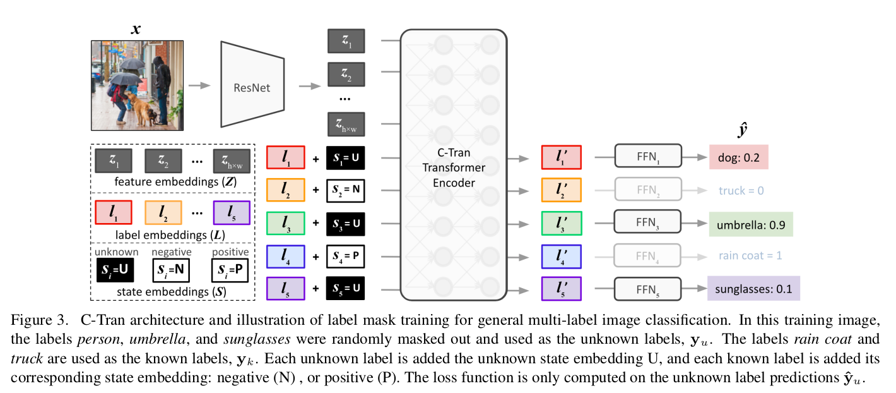  
+ **C-Tran (Classificcation transformer)**: Transformer-based model for multi-label image classification that exploits dependencies among a target set of labels
	- _Training_: Image & Mask Randome Label => C-Tran => predict masked label
		- Learn to reconstruct a partial set of labels given randomly masked input label embedding
	- _Inference_: Image & Mask Everything => C-Tran => predit all labels
		- Predict a set of target labels by masking all the input labels as unknown
+ **Architecture**:
	- Image => ResNet 101 => _feature embedding_ `Z`
	- Image => _label embedding_ `L` (represent l possible label) => add with _state embedding_ `s` (with 3 state unknow `U`, negative `N`, positive `P`)
	- `Z` & `L + s` => _C-Tran_ => `L'` (predicted label embedding) => _FFN_ => Y_hat (predicted label with posibility)
		- **_C-Tran_**:
			- Skip_Connection[MHSA => Norm] => Linear => ReLU => Linear
			- 3 transformer layers with 4 MHSA
		- **_FFN_**: label inference classifier with single linear layer & sigmoid activation
+ **Label Mask Training**:
	+ During training:
		- Randomly mask a certain amount of label
			-  Given `L` possilbe label => number of "unknown" (masked) labels `0.25L` <= `n` <= `L`
		- Using groundtruth of the other labels (via state embedding) => predict masked label (with cross entropy loss)
+ **Code**: to be updated

## **Object Detection/Segmentation Transformer**
This section introduces several attention-based architectures for object detection (DETR, AnchorDETR,...) and segmentation tasks (MaskFormer, TransUNet...), even for a specific task such as hand detection (HandsFormer). These architectures majorly are the combination of Transformer and CNN backbone for these sophisticated tasks, but few are solely based on the Transformer architecture (FTN).

### DETR (Detection Transformer)
+ **Paper**: https://arxiv.org/pdf/2005.12872.pdf  
  
+ **Transformer Encoder & Decoder**:
	- Share the same architecture with the original transformer
	- *Encoder:*
		- Input sequence: flattened 2D feature (Image => CNN => flatten) + learnable fixed positional encoding (add to each layer)
		- Output: encoder output in sequence
	- *Decoder:*
		- Input: Object queries (learned positional embeddings) + encoder output (input in the middle)
		- Output: output embeddings
		- The Decoder decode N objects in parallel at each decoder layer, not sequence one element at a time
		- The model can reason about all objects together using pair-wise relations between them, while being able to use whole image as content
+ **Prediction FFN**:
	- 3-layer MLP with ReLU  
	- Output embeddings as input
	- Predict normalized center coordinates, heigh and width of bounding box  
+ **Architecture**:
	Image => **_Backbone (CNN)_** => 2D representation => Flatten (+ Positional encoding) => **_Transformer Encoder-Decoder_** => **_Prediction FFN_** => bounding box
+ **Code**: https://github.com/facebookresearch/detr

### AnchorDETR
+ **Paper**: https://arxiv.org/pdf/2109.07107.pdf  
  
+ **Backbone**: ResNet40
+ The encoder/decoder share the same structure as DETR
	- However, the self-attention in the encoder and  decoder blocks are replaced by Row-Column Decouple Attention
+ **Row-Column Decouple Attention**:
	- Help reduce the GPU memeory when facing with high-resolution feature
	- _Main idea_:
		- Decouple key feature `Kf` into row feature `Kf,x` and column feature `Kf,y` by 1D global average pooling
		- Then perform the row attetion and column attentions separately
+ **Code**: https://github.com/megvii-research/AnchorDETR

### MaskFormer
+ **Paper**: https://arxiv.org/pdf/2107.06278.pdf  
  
+ **Pixel-level module**:
	- Image => **_Backbone (ResNet)_** => image feature `F` => **_Pixel decoder (upsampling)_** => per-pixel embedding `E_pixel`
+ **Transformer module (Decoder only)**:
	- Standard Transformer decoder
	- N queries (learneable positional embeddings) + `F` (input in the middle) => **_Tranformer Decoder_** => N per-segment embeddings `Q`
	- Prediction in parallel (similar to DETR)
+ **Segmentation module**:
	- `Q` => *MLP (2 Linears + solfmax)* => N mask embeddings `E_mask` & N class predictions
	- *Dot_product*(`E_mask`, `E_pixel`) => sigmoid => Binary mask predictions
	- *Matrix_mul*(Mask predictions, class predictions) => Segmantic segmentation
+ **Code**: https://github.com/facebookresearch/MaskFormer

### SegFormer
+ **Paper**: https://arxiv.org/pdf/2105.15203.pdf  
  
+ **Input**: Image `[H, W, 3]` => patches of size 4x4 (rather than 16x16 like ViT)
	- Using smaller patches => favor the dense prediction task
	- Do not need positional encoding (PE):
		- Not necessary for semantic segmentation
		- The resolution of PS is fixed => needs to be interpolated when facing different test resolutions => dropped accuracy
+ **Hierarchical Transformer Encoder**: extract coarse and fine-grained features, partly inspired by ViT but optimized for semantic segmentation
	- Overlap patch embeddings => [**_Transformer Block_** => Downsampling] x 4 times => CNN-like multi-level feature map `Fi`
		- Feature map size: `[H, W, 3]` => `F1` `[H/4, W/4, C1]` => `F2` `[H/8, W/8, C2]` => ... => `F4` `[H/32, W/32, C4]`
			- Provide both high and low-resolution features => boost the performance of semantic segmentation
		- Transformer Block1: Efficient Self-Atnn => Mix-FNN => Overlap Patch Merging
			- **_Efficient Self-Attention_**: Use the reduction ratio R on sequence length N = H x W (in particular, apply stride R) => reduce the complexity by R times
			- **_Mix-FFN_**: Skip_Connection[MLP => Conv3x3 => GELU => MLP] which considers the effect of zero padding to leak location information (rather than positional encoding)
			- **_Overlapped Patch Merging_**: similar to the image patch in ViT but overlap => combine feature patches
+ **Lightweight All-MLP Decoder**: fuse the multi-level features => predict semantic segmentation mask
	1. **_1st Linear layer_**: unifying channel dimension of multi-level features `Fi` (from the encoder)  
	2. `Fi` are **_upsampler_** to 1/4th and **_concat_** together  
	3. **_2nd Linear layer_**: fusing concatenated features `F`
	4. **_3rd Linear layer_**: predicting segmentation mask M `[H/4, W/4, N_cls]` with `F`
+ **Code**: https://github.com/lucidrains/segformer-pytorch

### Fully Transformer Networks
+ **Paper**: https://arxiv.org/pdf/2106.04108.pdf  
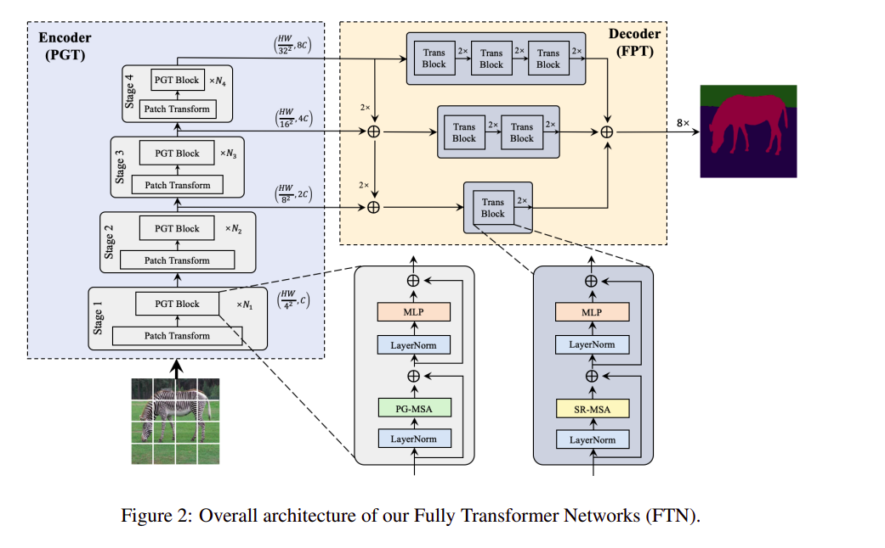  
+ Fully Transformer Networks for semantic image segmentation, without relying on CNN.
	- Both the encoder and decoder are composed of multiple transformer modules
	- **_Pyramid Group Transformers (PGT) encoder_** to divide feature maps into multiple spatial groups => compute the representation for each
		- Capable to handle spatial detail or local structure like CNN
		- Reduce unaffordable computational & memory cost of the standard ViT; reduce feature resolution and increase the receptive field for extracting hierarchical features
	- **_Feature Pyramid Transformer (FPT) decoder_** => fuse semantic-level & spatial level information from PGT encoders => high-resolution, high-level semantic output
+ **Architecture**:
	- Image => Patch => PGT Encoder => FPT Decoder => linear layer => bilinear upsampling => probability map => argmax(prob_map) => Segmentation
	- **_PGT_**: four hierarchical stages that generate features with multiple scales, include Patch Transform (non-overlapping) + PGT Block to to extract hierarchical representations
		+ PGT Block: Skip_Connection[Norm => PG-MSA] => Skip_Connection[Norm => MLP]
		+ **_PG-MSA (Pyramid-group transformer block)_**: `Head_ij`=Attention(Qij,Kij,Vij) => `hi` = reshape(Head_ij) => PG-MSA = Concat(`hi`)
	- **_FPT_**: aggregate the information from multiple levels of PGT encoder => generate finer semantic image segmentation
		+ The scale of FPT is not larger the better for segmentation (with limited segmentation training data) => determined by depth, embedding dim, and the reduction ratio of SR-MSA 
		+ **_SR-MSA (Spatial-reduction transformer block)_**: reduce memory and computation cost by spatially reducing the number of Key & Value tokiens, especially for high-resoluton representations
		+ The multi-level high-resolution feature of each branch => fusing (element-wise summation/channel-wise concatenation) => finer prediction
+ **Code**: To be updated

### TransUNet
+ **Paper**: https://arxiv.org/pdf/2102.04306.pdf  
  
+ **Downsampling (Encoder)**: using CNN-Transformer Hybrid
	+ (Medical) Image `[H, W, C]` => _**CNN**_ => 2D feature map => _**Linear Projection**_ (Flatten into 2D Patch embedding) => Downsampling => _**Tranformer**_ => Hidden feature `[n_patch, D]`
		- CNN: downsampling by 1/2 => 1/4 => 1/8
		- Transformer: Norm layer *before* MHSA/FFN (rather than applying Norm layer after MHSA/FFN like the original Transformer), total 12 layers
	+ Why using CNN-Transformer hybrid:
		- Leverages the intermediate high-resolution CNN feature maps in the Decoder
		- Performs better than the purge transformer
+ **Upsamling (Decoder)**: using Cascaded Upsampler 
	- Similar to the upsamling part of the [standard UNet](https://github.com/quanghuy0497/Deep-Learning-Specialization/tree/main/Course%204%20-%20Convolutional%20Neural%20Networks#u-net-architecture)
		- **_Upsampling_** => *concat* with corresponded CNN feature map (from the Encoder) => *Conv3x3 with ReLu*
		- **_Segmentation head_** (Conv1x1) at the final layer
	- Hidden Feature `[n_patch, D]` => reshape `[D, H/16, W/16]` => `[512, H/16, H/16]` => `[256, H/8, W/8]` => `[128, H/4, W/4]` => `[64, H/2, W/2]` => `[16, H, W]` => Segmentation head => Segmantic Segmentation
+ **Code**: https://github.com/KenzaB27/TransUnet

### UTNet (U-shape Transformer Networks)
+ **Paper**: https://arxiv.org/pdf/2107.00781.pdf  
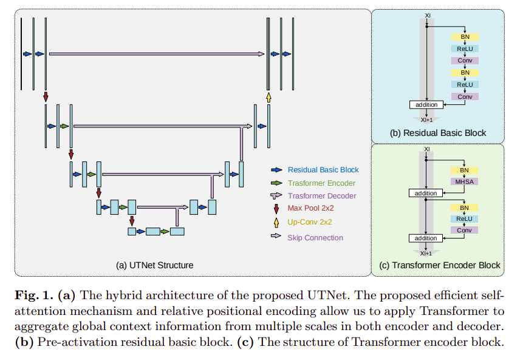
+ **Pipeline**:
	- Apply conv layers to extract local intensity feature, while using self-attention to capture long-range associative information
	- UTNet follows the standard design of UNet, but replace the last conv of the building block in each resolution (except the highest one) with the proposed Transformer module
	- Rather than using the convention MHSA like the standard Transformer, UTNet develops the _Efficient MHSA_ (quite similar to the one in SegFormer):
		- **_Efficient MHSA_**: Sub-sample `K` and `V` into low-dimensional embedding (reduce size by 8) using Conv1x1 => bilinear interpolation 
		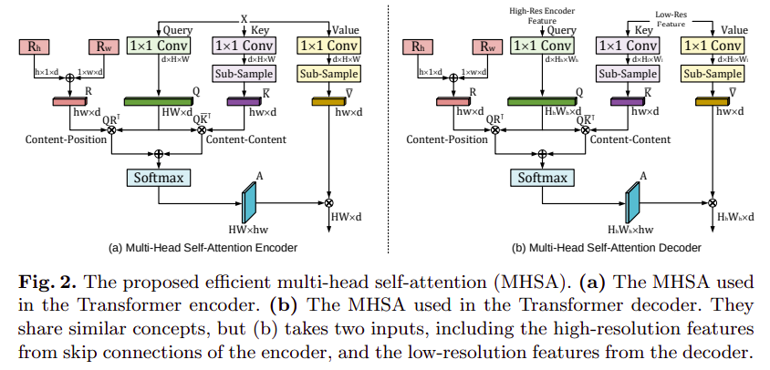
	- Using 2-dimensional relative position encoding by adding relative height and width information rather than the standard position encoding
+ **Code**: https://github.com/yhygao/UTNet

### SOTR (Segmenting Objects with Transformer)
+ **Paper**: https://arxiv.org/pdf/2108.06747.pdf  
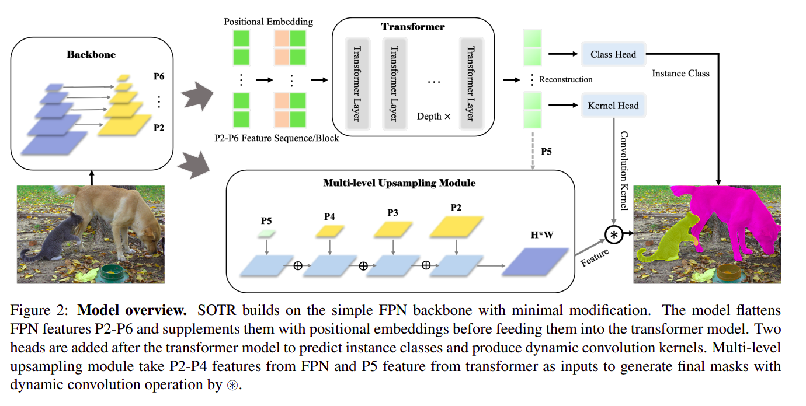  
+ Combines the advantages of CNN and Transformer
+ **Architecture**:
	+ **_Pipeline_**:
		- Image => _CNN Backbone_ => feature maps in multi-scale => patch recombination + positional embedding => clip-lvel feature sequences/blocks => _Transformer_ => global-level semantic feature => functional heads => class & conv kernel prediction 
		- Backbone output  => _Multi-level upsampling model_ (with dynamic conv) => dynamic conv(output, Kerner head) => instance masks
	+ **_CNN Backbone_**: Feature pyramid network
	+ **_Transformer_**: proposed 2 different transformer designs with Twin attention:
		- _Twin attention_: simplify the attention matrix with sparse representation (as the self-attention has both quadratic time and memory complicity) => higher computational cost
			- Calculate attention within each column (independent between columns) => calculate attention within each row (independent between rows) => connect together
			- Twin att. has a global receptive field & covers the information along 2 dimension
		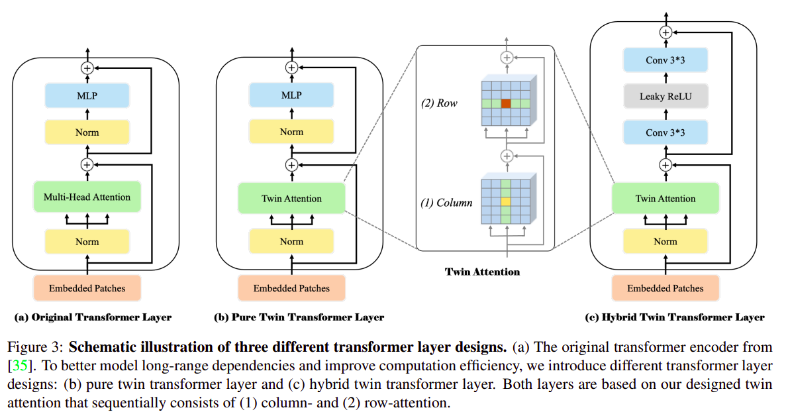  
		- Transformer layer:
			- _Pure twin layer_: Skip_Connection[Norm => Twin Att.] => Skip_Connection[Norm => MLP]
			- _Hybrid twin layer_: Skip_Connection[Norm => Twin Att.] => Skip_Connection[Conv3x3 => Leaky ReLU => Conv3x3]
			- Hybrid Twin comes with the best performance
	+  **_Multi-level upsampling model_**: P5 feature map + Positional from transformer + P2-P4 from FPN => [Conv3x3 => Group Norm => Relu, multi stage] => upsample x2, x4, x8 (for P3-P5) => added together => point-wise conv => upsamping => final `HxW` feature map
+ **Code**: https://github.com/easton-cau/SOTR

### HandsFormer
+ **Paper**: https://arxiv.org/pdf/2104.14639.pdf  
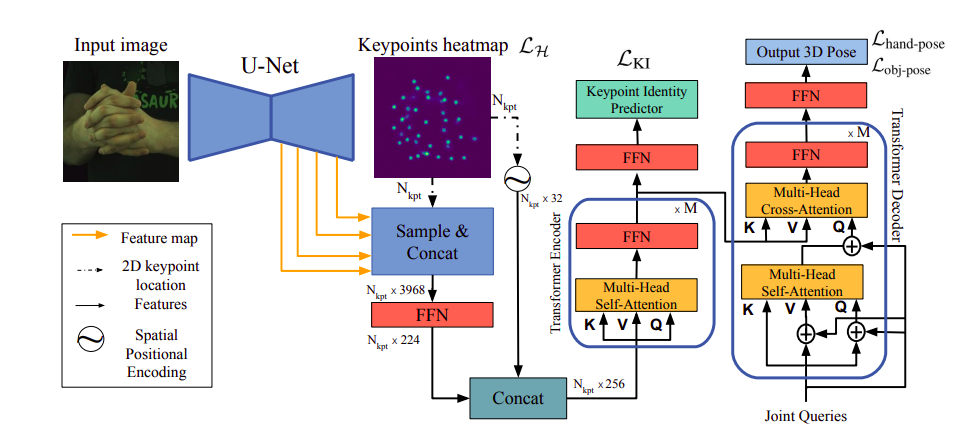  
+ **Architecute**:
	- Image => _UNet_ => Image features (from layers of UNet decoder) + Keypoint heatmap => _bilinear interpolation & concat_ => _FFN (3-layer MLP)_ => _concat_ with keypoint heatmap (with positional encoding) => keypoint representation (likely to correspond to the 2D location of hand joints)
		- Localizing the joints of hands in 2D is more accurate than directly regressing 3D location.
		- The 2D keypoints are a very good starting point to predict an accurate 3D pose for both hands
	- Keypoint representation => _Transformer encoder_ => FFN (2-layer MLP + linear projection) => _Keypoint Identity predictor_ [2 FC layer => linear projection => Softmax] => 2D pose 
	- [Joint queries, Transform encoder output] => _Transform decoder_ => 2-layer MLP + linear projection => 3D pose
+ **Code**: To be updated

### Unifying Global-Local Representations in Salient Object Detection with Transformer
+ **Paper**: https://arxiv.org/pdf/2108.02759.pdf  
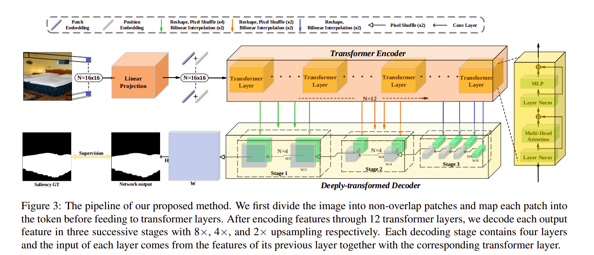
+ Jointly learn global and local features in a layer-wise manner => solving the salient object detection task with the help of Transformer
	- With the self-attention mechanism => transformer is capable to model the "contrast" => demonstrated to be crucial for saliency perception
+ **Architecture**:  
	+ **_Encoder_**:
		- Input => split to grid of fixed-size patches => _linear projection_ => feature vector (represent local details) + positional encoding => _Encoder_ => encode global features without diluting the local ones
		- The Encoder includes 17 layers of standard transformer encoder.
	+ **_Decoder_**:  
		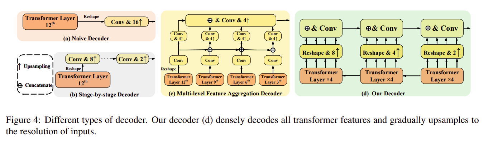  
		- Decode the features with global-local information over the inputs and the previous layer from encoder by densely decode => preserve rich local & global features.
	 	- The density decoder contains various types of decoder blocks, including:
		 	- **_Naive Decoder_**: directly upsampling the outputs of last layer => same resolution of inputs => generating the saliency map. Specifically, 3 Conv-norm-ReLU are aplied => bilinearly upsample x16 => sigmoid
		 	- **_Stage-by-Stage Decoder_**: upsamples the resolution x2 in each stage => miltigate the losses of spatial details. Specifically, 4 stage x [3 Conv-norm-ReLU => sigmoid]
		 	- **_Multi-level Feature Decoder_**: sparsely fuse multi-level features, similar to the pyramid network. Specifically take feature F3, F6, F9, F12 (from the corresponed layers of encoder) => upsample x4 => several conv layers => fused => saliency maps
		- **_Density Decoder_**: integrate all encoder layer features => upsample to the same spatial resolution of input (include pixel suffle & bilinear upsampling x2) => concat => salient feature => Conv => sigmoid => saliency map
+ **Code**: https://github.com/OliverRensu/GLSTR

## **Few-shot Transformer**
This section introduces transformer-based architecture for few-shot learning, mainly for but not strictly to the object detection and segmentation area. Overall, these pipeline architectures are quite complex, so I recommend you should read the paper along with these reviewes for better understanding. Then again, this list will be updated regularly.

### Meta-DETR: Image-Level Few-Shot Object Detection with Inter-Class Correlation Exploitation
+ **Paper**: https://arxiv.org/pdf/2103.11731.pdf  

+ Employ Deformable DETR and original Transformers as basic detection framework
+ **Architecture**:
	- Query image, Support images => Feature Extractor(ResNet-101) => Positional Encoding => Query/Support features => **_Correlational Aggregation Module_** => Support-Aggregated Query Feature => **_Transformer Encoder-Decoder_** => **_Prediction Head_** => Few-shot detection
+ **Correlation Aggregation Module (CAM)**:
	  
	- Key-compoment in Meta-DETR => aggregates query features with support classes => class-agnostic prediction
		- Can aggregate multiple support classes simultaneously => capture inter-class correlations => reduce misclassification, enhance generalization
	- Pipeline:
		- Query & Support features => MHSA => ROIAlign + Average pooling (on the support feature only) => Query feature map `Q` & Support prototypes `S` 
		- `S` = Concat(`S`, BG-Prototype); Task Encodings `T` = Concat(`T`, BG-Encoding)
		- [`Q`, `S`, `T`] => Feature maching & Encoding matching (in parallel) => FFN => Support-Aggregated Query Features
	- **_Feature matching_**:
		- [`Q`, Sigmoid(`S`), `S`] => Single-Head Attention => Element-wise multiplication => feature matching output `Qf`
	- **_Encoding Matching_**:
		- [`T`, `Q`, `S`] => Single-Head Attention => encoding output `Qe`
	- **_FFN_**:
		Element-wise Add(`Qf`, `Qe`) => FFN => Support-Aggregated Query features
+ **Transformer Encoder-Decoder**:
	- Follow the [Deformable DETR](https://arxiv.org/pdf/2010.04159.pdf) architecture with 6 layer
		- Adapt Multi-scale deformable attention, with the CAM is counted as one encoder layer
	- Support-Aggregated Query features => Encoder-Decoder => Embedding `E`
+ **Prediction Head**:
	- `E` => FC, Sigmoid => Confidence score
	- `E` => FC, ReLU + FC, ReLU + FC, Sigmoid => Bounding Box
+ **Code**: https://github.com/ZhangGongjie/Meta-DETR

### Boosting Few-shot Semantic Segmentation with Transformers
+ **Paper**: https://arxiv.org/pdf/2108.02266.pdf  

+ **Architecture**:
	- Support/Query Images => Backbone (VGG/ResNet) => PANet => PFENet => `X`
		- **_PANet_**: Computer similarity between query features and support prototypes
		- **_PFENet_**: Concat(Query features; Expanded Support Prototypes; Prior Mask)
	- `X` => **_Multi-scale Processing_** => **_Global/Local Enhancement Module_** (with 2 ouput `T` and `Z` respectively) => Concat(T, Z) => MLP => Few-shot Semantic Segmentation
+ **Multi-scale Processing**:
	- Information over different scales (of the input feature maps `X` from support/query images) can be utilized
	- Multi-scaling with Global Average Pooling => feature Pyramid `Xi` = {X1, X2,...,Xn}
+ **Global Enhancement Module (GEM)**:
	- Using **_Transformer_** => enhance the feature to exploit the global information
	- `Xi` => FC layer (for channel reduction) => `X'i` => **_Feature Merging Unit_** (FMU) => `Yi`
		- FMU: 
			- `Yi` =  `X'i` if i=1; 
			- `Yi` =  (Conv1x1(*Concat*(`X'i`, `Ti-1`)) + `X'i`) if i>1
	- `Yi` => [**_MHSA_** => MLP (2 Linear)] => MHSA => `Ti` => `T`
		- MHSA with GELU and Norm
		- [MHSA => MLP] repeat L times with L = 3
		- `T` = = *Concat*(T1, T2,...Tn) at layer L
+ **Local Enhancement Module (LEM)**:
	- Follow the same pipeline as GEM:
		- `Xi` => FC layer => FMU => `Yi` => Conv => output
	- Rather than using transformer in GEM, LEM using **_Convolutional_** => encode the local information
	- LEM output: {Z1, Z2,...,Zn}  
+ **Segmentation Mask Prediction**:
	- Local/Global output: `Z` = *Concat*(Z1, T2,...Tn)
	- `Z` => MLP => target mask `M`
+ **Code**: https://github.com/GuoleiSun/TRFS

### Few-Shot Segmentation via Cycle-Consistent Transformer
+ **Paper**: https://arxiv.org/pdf/2106.02320.pdf  
  
+ **Architecture**:
	+ Query & Support Images => Backbone (ResNet) => Image features `Xq` and `Xs` => Concat the mask averaged support feature to `Xq` and `Xs` => Flatten into 1D sequence by Conv1x1 (with shape HW x D) => (**_CyC-Transformer_**, L times) => reshaping => **_Conv-head_** => segmentation mask
	+ `Xq` and `Xs` has token represented by feature `z` at on pixel location => beneficial for segmentation
+ **CyC-Transformer**:
	+ **_Self-Alignment block_**:
		- Just like the original Transformer encoder
		- Flatten query feature as input (query only)
		- Pixel-wise feature of query images => aggregate their global context information
	+ **_Cross-alignment block_**:
		- Replace MHSA with **_CyC-MHA_**
		- Flatten query feature and sample of support feature as input
		- Performs attention between query and support pixel-wise features => aggregate relevant support feature into query ones
	+ **_Cycle-Consistent Multi-head Attention (CyC-MHA)_**:
		- Alleviate the excessive harmful support features that confuse pure pixel-level attention
		- Pipeline:
			-  Affinity map A is calculated => measure the correspondence relationship between all query and support tokens
			- For a single token position j (j={0,...Ns}), its most similar point `i*` = argmax A(`i`,`j`) with i={0,...HqWq} is the index of flatten query feature
			- Construct **_Cycle-consistency_** (CyC) relationship for all tokens in the support sequence
				- The cycle-consistency help avoids being bias by possible harmful feature effectively (facing when training for few-shot segmentation)
			- Finally, CyC-MHA = softmax(Ai + B)V
				- Where B (with only 2 value -inf and 0) is the additive bias element-wise added to aggregate support feature and V is the value sequence
		- With B, the attention weight tends to be zero => irrelevant information will not be consider
		- CyC encourages the consistency between most relative features between query and support => produce consistent feature representation
+ **Conv-head**:
	- Output of CyC-MHA => reshaping to spatial dimensions => Conv-Head (Cov3x3 => ReLu => Conv1x1) => Segmentation Mask
+ **Code**: To be updated

### Few-shot Semantic Segmentation with Classifier Weight Transformer
+ **Paper**: https://arxiv.org/pdf/2108.03032.pdf  
  
+ **Architecture**:
	- **_First stage_**: pre-train encoder/decoder (**PSPNet** pre-trained on ImageNet) with supervised learning => stronger representation
		- Support/Query Image => Encoder-Decoder (**PSPNet**) => Linear clasifier with Support Mask (Support only) => Classifier (Support only) => [Classifier weight `Q`, Query feature `K`, Query feature `V`]
	- **_Second stage_**: meta-train the Classifier Weight Transformer (CWT) only (as the encoder-decoder capapble to capture generalization of unseen class)
		- [`Q`,`K`,`V`] => Skip_Connection[Linear => MHSA => Norm] => Conv operation with `Q` => Prediction Mask
+ **Code**: https://github.com/zhiheLu/CWT-for-FSS

### Few-shot Transformation of Common Actions into Time and Space
+ **Paper**: https://openaccess.thecvf.com/content/CVPR2021/papers/Yang_Few-Shot_Transformation_of_Common_Actions_Into_Time_and_Space_CVPR_2021_paper.pdf  
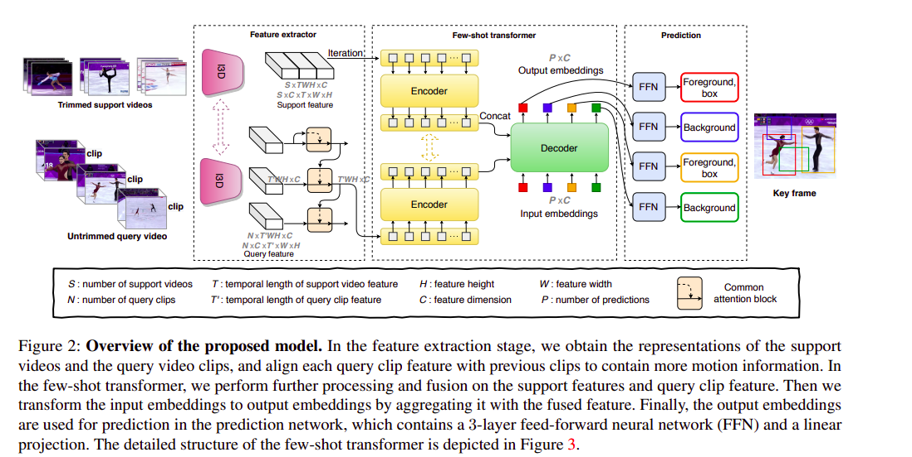  
+ The goal is localize the spatio-temporal tubelet of an action in an _untrimmed query video_ based on the common action in the _trimment support video_
+ **Architecture**:  
	+ **_Pipeline_**:
		- Untrimmed query video => split into clips + few support video => _Video feature extractor_ (I3D) => spatio-temporal representation => _Common Attention block_ => aligned with previous clip feature => query clip feature 
		- Query clip feature => _Few-shot Transformer (FST)_ => fuse the support features into the query clip feature => aggregating with input embedding
		- Top of output embedding (from FST) => _Precition network_ => final tubelet prediction
	+ **_Video feature extractor_**:
		- Adapt I3D as backbone to obtain spatio-temporal representation of a single query video & few support videos
		- Support video => feed the whole video to the backbone directly
		- Untrimmed query video => split into multiple clips => backbone network
		- **_Common attention block_**: built on self-attention mechanism & non-local structural => model long-term spatio-temporal information
			- Formula: `A^(I1,I2) = I1 + Linear(Norm[A(I1,I2)])`
				- With `A^` is the common attention, A is the standard attention, I1, I2 are 2 inputs
			- Common attention aligns each query clip feature with its previous clip features => contain more motion information => benefit the common action localization
	+ **_Few-shot Transformer (FST)_**:    
	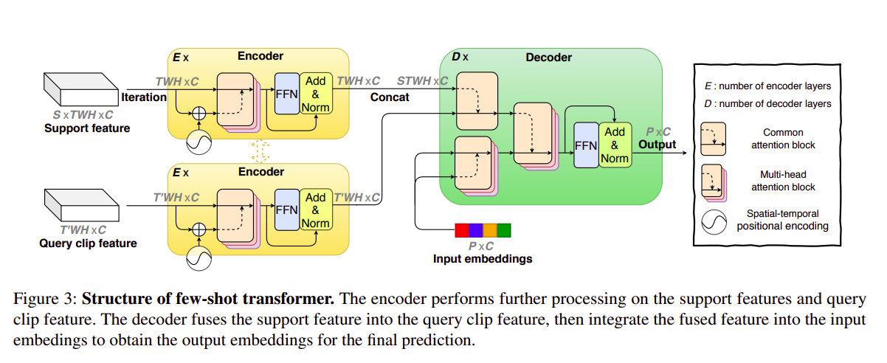   
		- _Encoder_: standard architecture with MHSA. The input is supplied with fixed spatio-temporal positional encoding.
			- Support branch: the support video => encoder one by one => concat => `Es` => decoder (along with `Eq`)
			- Quary branch: enhanced query clip => encoder => `Eq` => decoder
			- The FFN can be a Conv1x1
		- _Decoder_: 3 input [`Es`, `Eq`, input embedding (learnt positional encoding)] => Common attention/MHSA => MHSA => FFN => Add&Norm => output embedding
	+ **_Prediction network_**: output embedding => 3-layer FFN with ReLU => linear projection => normalized center coordinates => final action tubes for the whole untrimmed query video
+ **Code**: To be updated

### A Universal Representation Transformer Layer for Few-Shot Image Classification
+ **Paper**: https://arxiv.org/pdf/2006.11702.pdf  
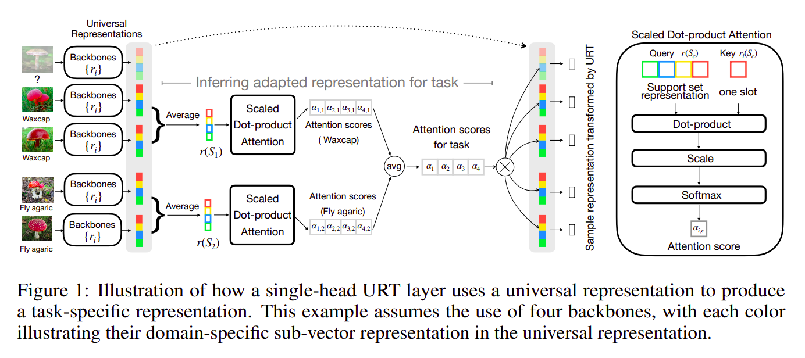  
+ URT layer is inspired from the standard Transformer network to effectively **_integrate the feature representations_** from the _diverse set_ of training domains
	- Uses an attention mechanism to learn to retrieve or blend the appropriate backbones to use for each task
	- Training URT layer across few-shot tasks from many domains => support transfer across these tasks
+ **Architecture**:
	- `ri(x)` is the output vector from the backbone for domain `i` => `r(x)` = concat[r1(x),...rm(x)] on `m` pre-trained backbones
	- representation of Support set class `r(Sc) = sum[r(x)]/|Sc|`
	- For each class `c`, query `Qc` = Linear(`r(Sc)`) with weight `Wc`, bias `bc`; For each domain `i` and class `c`, key `Kic` = Linear(`ri(Sc)`) with `Wk, bk`
	- Then, with `Qc`, `Kic`, the scale dot-product attention `Aic` is calculated as usual
	- The adapted representation for the support & query set examples is compute by `O(x) = Sum(Ai*ri(x)`
	- Finally, the multi-head URT `O(X)` is the concatenation of all `O(x)`, just like usual.
+ **Code**: https://github.com/liulu112601/URT

## Resources
+ Paper collections about Transformer in Computer Vision: 
	- https://github.com/dk-liang/Awesome-Visual-Transformer
	- https://github.com/DirtyHarryLYL/Transformer-in-Vision
	- https://github.com/Yangzhangcst/Transformer-in-Computer-Vision
+ There are plenty of ViT-based models and versions in this repository, in Pytorch:
	- https://github.com/lucidrains/vit-pytorch
+ Paper collections about improving the Attention block (computational complexity):
	- https://github.com/Separius/awesome-fast-attention

  
  
These notes were created by [quanghuy0497](https://github.com/quanghuy0497/Transformer4Vision)@2021
