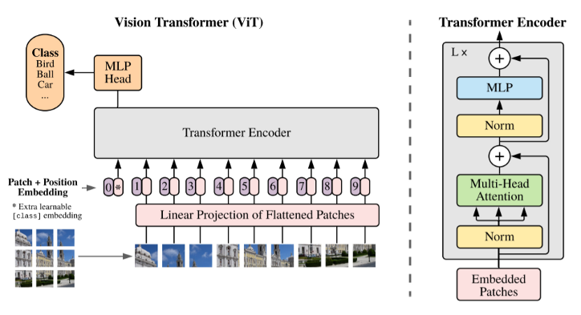

## Table of contents
* [Standard Transformer](#Standard-Transformer)
	* [Original Transformer](#Original-Transformer)
	* [Vision Transformer (ViT)](#Vision-Transformer-ViT)
* [Object Detection/Segmentation Transformer](#Object-Detection-Segmentation-Transformer)
	* [Detection Transformer (DETR)](#Detection-Transformer-DETR)
	* [MaskFormer](#MaskFormer)
	* [TransUNet](#TransUNet)
	* [SegFormer](#SegFormer)
* [Few-shot Segmentation Transformer](#Few-shot-segmentation-transformer)
	* [Boosting Few-shot Semantic Segmentation with Transformers](#Boosting-Few-shot-Semantic-Segmentation-with-Transformers)
	* [Few-Shot Segmentation via Cycle-Consistent Transformer](#Few-Shot-Segmentation-via-Cycle-Consistent-Transformer)
	* [Meta-DETR: Image-Level Few-Shot Object Detection with Inter-Class Correlation Exploitation](#Meta-DETR-Image-Level-Few-Shot-Object-Detection-With-Inter-Class-Correlation-Exploitation)
	* [Few-shot Semantic Segmentation with Classifier Weight Transformer](#Few-shot-Semantic-Segmentation-with-Classifier-Weight-Transformer)

## Standard Transformer
### Original Transformer
+ **Paper**: https://arxiv.org/abs/1706.03762
  
+ **Input**: 
	- Sequence embedding (e.g. word embeddings of a sentence)
	- Positional Encoding => encode the _positions of embedding word within the sentence_ in the input of Encoder/Decoder block
+ **Encoder**:
	- Embedding words => Skip_Connection[MSA => Norm] => Skip_Connection[FFN => Norm] => Encoder output
		- MSA: Multi-head Self Attention
		- FFN: FeedForward Neural Network
	+ Repeat N times (N usually 6)
+ **Decoder**:
	- Decoder input:
		- Leaned output of the decoder (initial token in the begining, learned sentence throughout the process)
		- Encoder input (put in the middle of the Decoder, denote as E)
	- (Input + Positional Encoding) => Skip_Connection[MSA + Norm] => Skip_Connection[(+E) => MSA => Norm] => Skip_Connection[FFN + Norm] => Linear => Softmax => Decoder Output
	- Using the decoder output as the input for next round, repeat N times (N ussually 6)
+ [Read here](https://github.com/quanghuy0497/Deep-Learning-Specialization/tree/main/Course%205%20-%20Sequence%20Models#transformer-network-1) for more detail

### Vision Transformer (ViT)
+ **Paper**: https://arxiv.org/pdf/2010.11929.pdf
  
+ **Input**:
	-  Image [H, W, C] => non-overlapped patches (conventionally 16x16 patch size) => flatten into sequence => linear projection (vectorized + Linear) => **_patch embeddings_**
	- **_Positional encoding_** added to the patch embeddings for location information of the patchs sequence
	- Extra learnable `[Cls]` token (embedding) + positional 0 => attached on the head of the embedding sequence (denote as `Zo`)
+ **Architecture**: (Patch + Position Embedding) => Transformer Encoder => MLP Head for Classification
	-  **_Transformer Encoder_**: Skip_Connection[Norm => MSA] => Skip_Connection[Norm + MLP (Linear, GELU, Linear)] => output
	- **_MLP Head for classification_**:  `C0` (output of `Z0` after went through the Transformer Encoder) => **_MLP Head_** (Linear + Softmax) => classified label
+ **Good video explanation**: https://www.youtube.com/watch?v=HZ4j_U3FC94
+ **Code**: https://github.com/lucidrains/vit-pytorch

## Object Detection/Segmentation Transformer

### Detection Transformer (DETR)
+ **Paper**: https://arxiv.org/pdf/2005.12872.pdf  
  
+ **Transformer Encoder & Decoder**:
	- Share the same architecture with the original transformer
	- *Encoder:*
		- Input sequence: flattened 2D feature (Image => CNN => flatten) + learnable fixed positional encoding (add to each layer)
		- Output: encoder output in sequence
	- *Decoder:*
		- Input: Object queries (learned positional embeddings) + encoder output (input in the middle)
		- Output: output embeddings
		- The Decoder decode N objects in parallel at each decoder layer, not sequence one element at a time
		- The model can reason about all objects together using pair-wise relations between them, while being able to use whole image as content
+ **Prediction FFN**:
	- 3-layer MLP with ReLU  
	- Output embeddings as input
	- Predict normalized center coordinates, heigh and width of bounding box  
+ **Architecture**:
	Image => **_Backbone (CNN)_** => 2D representation => Flatten (+ Positional encoding) => **_Transformer Encoder-Decoder_** => **_Prediction FFN_** => bounding box
+ **Code**: https://github.com/facebookresearch/detr

### MaskFormer
+ **Paper**: https://arxiv.org/pdf/2107.06278.pdf  
  
+ **Pixel-level module**:
	- Image => **_Backbone (ResNet)_** => image feature `F` => **_Pixel decoder (upsampling)_** => per-pixel embedding `E_pixel`
+ **Transformer module (Decoder only)**:
	- Standard Transformer decoder
	- N queries (learneable positional embeddings) + `F` (input in the middle) => **_Tranformer Decoder_** => N per-segment embeddings `Q`
	- Prediction in parallel (similar to DETR)
+ **Segmentation module**:
	- `Q` => *MLP (2 layer + solfmax)* => N mask embeddings `E_mask` & N class predictions
	- *Dot_product*(`E_mask`, `E_pixel`) => sigmoid => Binary mask predictions
	- *Matrix_mul*(Mask predictions, class predictions) => Segmantic segmentation
+ **Code**: https://github.com/facebookresearch/MaskFormer

### TransUNet
+ **Paper**: https://arxiv.org/pdf/2102.04306.pdf  
  
+ **Downsampling (Encoder)**: using CNN-Transformer Hybrid
	+ (Medical) Image [H, W, C] => _**CNN**_ => 2D feature map => _**Linear Projection**_ (Flatten into 2D Patch embedding) => Downsampling => _**Tranformer**_ => Hidden feature [n_patch, D]
		- CNN: downsampling by 1/2 => 1/4 => 1/8
		- Transformer: Norm layer *before* MSA/FFN (rather than applying Norm layer after MSA/FFN like the original Transformer), total 12 layers
	+ Why using CNN-Transformer hybrid:
		- Leverages the intermediate high-resolution CNN feature maps in the Decoder
		- Performs better than the purge transformer
+ **Upsamling (Decoder)**: using Cascaded Upsampler 
	- Similar to the upsamling part of the [standard UNet](https://github.com/quanghuy0497/Deep-Learning-Specialization/tree/main/Course%204%20-%20Convolutional%20Neural%20Networks#u-net-architecture)
		- **_Upsampling_** => *concat* with corresponded CNN feature map (from the Encoder) => *Conv3x3 with ReLu*
		- **_Segmentation head_** (Conv1x1) at the final layer
	- Hidden Feature [n_patch, D] => reshape [D, H/16, W/16] => [512, H/16, H/16] => [256, H/8, W/8] => [128, H/4, W/4] => [64, H/2, W/2] => [16, H, W] => Segmentation head => Segmantic Segmentation
+ **Code**: https://github.com/KenzaB27/TransUnet

### SegFormer
+ **Paper**: https://arxiv.org/pdf/2105.15203.pdf  
  
+ **Input**: Image [H, W, 3] => patches of size 4x4 (rather than 16x16 like ViT)
	- Using smaller patches => favor the dense prediction task
	- Do not need positional encoding (PE):
		- Not necessary for semantic segmentation
		- The resolution of PS is fixed => needs to be interpolated when facing different test resolutions => dropped accuracy
+ **Hierarchical Transformer Encoder**: extract coarse and fine features, partly inspired by ViT but optimized for semantic segmentation
	- Overlap patch embeddings => [**_Transformer Block_** => Downsampling]x 4 times => CNN-like multi-level feature map
		- Feature map size: [H, W, 3] => [H/4, W/4, C1] => [H/8, W/8, C2] => ... => [H/32, W/32, C4]
			- Provide high and low-resolution features => boost the performance of semantic segmentation
		- Transformer Block1: Efficient Self-Atnn => Mix-FNN => Overlap Patch Merging
			- **_Efficient Self-Attention_**: Use the reduction ratio R on sequence length N = H x W => reduce the complexity from O(N^2) to O(N^2/R)
			- **_Mix-FFN_**: Skip_Connection[MLP => Conv3x3 => GELU => MLP] which considers the effect of zero padding to leak location information (rather than positional encoding)
			- **_Overlapped Patch Merging_**: similar to the image patch in ViT but overlap => combine feature patches
+ **Lightweight All-MLP Decoder**: fuse the multi-level features => predict semantic segmentation mask
	- Multi-level features (from the encoder) => **_1st MLP_** (to unify the channel dimension) => Upsampler => Concat => **_2nd MLP_** (For fusing concantenated features) => **_3rd MLP_** (for predciting segmentation mask)
+ **Code**: https://github.com/lucidrains/segformer-pytorch

## Few-shot Segmentation Transformer

### Boosting Few-shot Semantic Segmentation with Transformers
+ **Paper**: https://arxiv.org/pdf/2108.02266.pdf

### Few-Shot Segmentation via Cycle-Consistent Transformer
+ **Paper**: https://arxiv.org/pdf/2106.02320.pdf

### Meta-DETR: Image-Level Few-Shot Object Detection with Inter-Class Correlation Exploitation
+ **Paper**: https://arxiv.org/pdf/2103.11731.pdf

### [Few-shot Semantic Segmentation with Classifier Weight Transformer
+ **Paper**: https://arxiv.org/pdf/2108.03032.pdf